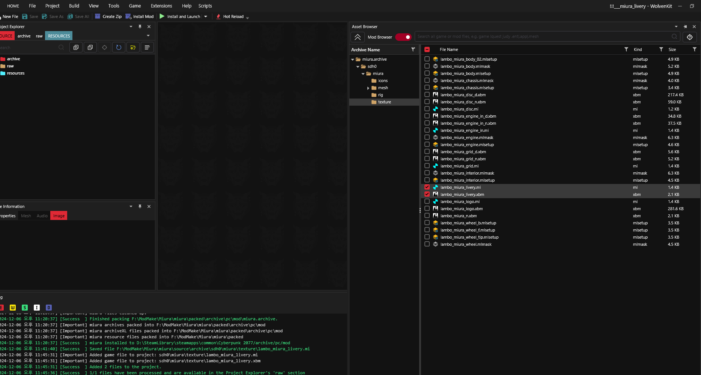
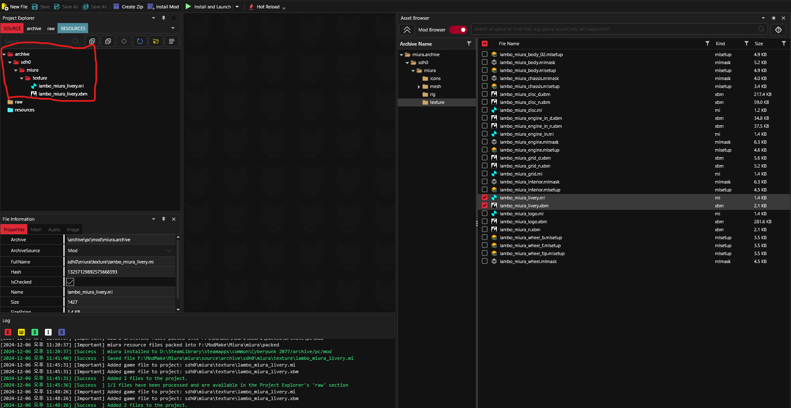
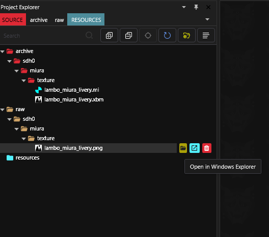
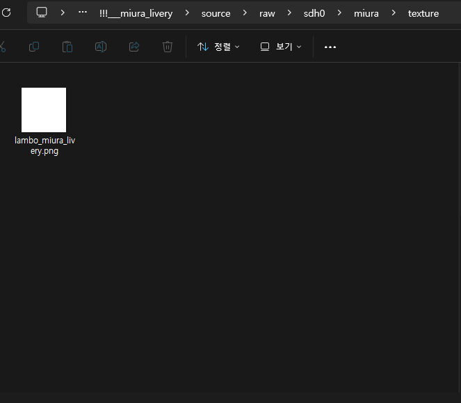
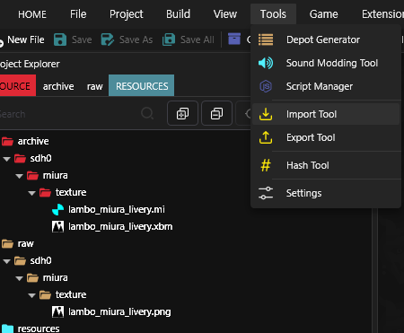

# Replacing Textures for Mod Vehicles

## **Summary**

**Published: Dec 11 2024 by SDH0**\
**Last documented edit: Dec 11 2024 by** [mana vortex](https://app.gitbook.com/u/NfZBoxGegfUqB33J9HXuCs6PVaC3 "mention")

This guide will teach you how to replace textures on a modded vehicle.

## Prerequisites

* [ ] A Wolvenkit Project (see[WolvenKit Projects #Create a new WolvenKit mod project](https://app.gitbook.com/s/-MP_ozZVx2gRZUPXkd4r/wolvenkit-app/usage/wolvenkit-projects#create-a-new-wolvenkit-mod-project "mention"))\
  Make sure to call it something like `###_projectname`, so that it loads [before](../../../for-mod-users/users-modding-cyberpunk-2077/load-order.md) the existing mod
* [ ] A texture (.png) for replacing

## Changing the texture

### 1. Finding the file in the mod

Switch the [Asset Browser](https://app.gitbook.com/s/-MP_ozZVx2gRZUPXkd4r/wolvenkit-app/editor/asset-browser) to the [Mod Browser](https://app.gitbook.com/s/-MP_ozZVx2gRZUPXkd4r/wolvenkit-app/editor/asset-browser#mod-browser):

<figure><figcaption></figcaption></figure>

Now, use the [Wolvenkit Search](https://app.gitbook.com/s/-MP_ozZVx2gRZUPXkd4r/wolvenkit-app/usage/wolvenkit-search-finding-files) to find the texture that you want to replace.\
\&#xNAN;_(I'm going to replace the Livery texture on my Miura)_

* Textures have the file extension `.xbm`
* You can filter the list on the left by file name, or browse the list on the left until you have found the right mod. \\

<figure><figcaption></figcaption></figure>

## 2. Adding the required files


The files you need are different from mod to mod. However, you need at least the `.xbm` with the actual texture.


In the example, I will also add the `.mi` ([material instance](../../../for-mod-creators-theory/files-and-what-they-do/file-formats/materials/re-using-materials-.mi.md)). This file holds the texture's properties (like its path). By adding the .mi file, you can customize the decal even further.

Add the files to your mod by double-clicking them.

<figure><figcaption>
 
</figcaption></figure>

### 3. Exporting the texture

After adding the texture, you can now [export it to .png](../../textures-and-luts/images-importing-editing-exporting.md).

<figure><figcaption></figcaption></figure>

<figure><figcaption></figcaption></figure>

The resulting texture will show up in your project's [`raw` folder](https://app.gitbook.com/s/-MP_ozZVx2gRZUPXkd4r/wolvenkit-app/editor/project-explorer#raw) (use the `source` tab to see all project files)

<figure><figcaption></figcaption></figure>

### 4. Overwriting the texture

Click the yellow folder shape next to the `.png` file to open the Windows Explorer.\\

<figure><figcaption></figcaption></figure>

Now replace the .png with the picture that you want:


The file name must be the same


<figure><figcaption></figcaption></figure>

### 5. Importing the texture

Now [import your texture](../../textures-and-luts/images-importing-editing-exporting.md#importing-a-texture) back into the `.xbm.`

<figure><figcaption></figcaption></figure>

<figure><figcaption></figcaption></figure>

\
\
.png>)\\


You can see in the project explorer that your texture has been replaced


<figure><figcaption></figcaption></figure>

### 6. Testing your mod

[Install your mod](https://app.gitbook.com/s/-MP_ozZVx2gRZUPXkd4r/wolvenkit-app/menu/toolbar#install-and-launch) and launch the game.


You can use the **Install and Launch** button to do both at once!


If you spawn the car, you will now see that the texture has changed!

<figure><figcaption></figcaption></figure>


If you want to share your texture edit, you can do so by sharing the installed .archive.

