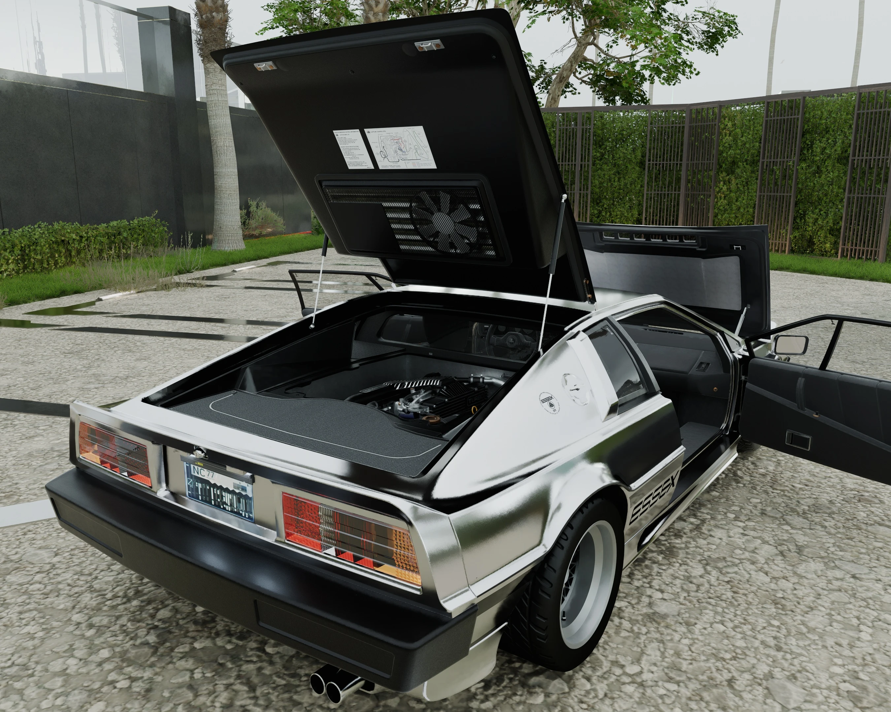

# Spinning fans on cars

You can find spinning ventilation fans all over the map. You can use one of those and incorporate it into you own mods for anything that spins, for example the cooling fan on a car engine.

<figure><figcaption></figcaption></figure>

## Preparation & Theory

### Finding a fan

* In WolvenKit's Asset Browser, search for "fan" and set the "Kind" filter to "mesh"
* choose one of the meshes that looks like, you guessed it, a fan. In this case, we'll be using `base\environment\decoration\public_utility\vents\tunnel_jet_fan\tunnel_jet_fan_a.mesh`.
* Right click on the file and select "Find files using this". Clear the "Kind" filter, right click on the `.ent` file which uses the `.mesh`, and choose "Open without adding to project". In this case, we'll be using `base\prefabs\environment\decoration\public_utility\vents\tunnel_jet_fan\tunnel_jet_fan_a.ent` . The following information will be specific to that file. You'll likely be able to adapt it to whatever file you're using because the basic setup is quite simple.

### The .ent and its components

Inside the file, there are three `components`:

* an `entMeshComponent`, which points to the `.mesh` file of the fan we've selected earlier
* a `gameTransformAnimatorComponent`, which is the thing that makes the `.mesh` file spin
* and an `entPlaceholderComponent`, which dictates the position and rotation of the `.mesh` (rotation here doesn't mean the spinning animation, but rather the angle of the `.mesh` itself relative to the ground)

You're probably already familiar with `entGarmentSkinnedMeshComponent`s from other mods you've already made, so this tutorial won't go into explaining the `entMeshComponent`. Related info can be found on the [Wiki](https://wiki.redmodding.org/cyberpunk-2077-modding/for-mod-creators-theory/files-and-what-they-do/file-formats/entity-.ent-files#mesh-component-entity-simple-entity) though. Of note is that the `entMeshComponent` must be parented to the `gameTransformAnimatorComponent`. This is done by setting the `bindName` of the `parentTransform` of the `entMeshComponent` to the `name` of the `gameTransformAnimatorComponent`. In our case, the `bindName` is `TransformAnimator0567` (pictured below).

The `gameTransformAnimatorComponent` defines how fast the fan spins and on which axis. These settings can be found in the dropdown under `animations > gameTransformAnimationDefinition > timeline > items`. There, the `duration` sets the speed (higher numbers means faster), and under `impl > axis`, you can set which axis it spins on. For example, if the `.mesh` is parallel to the horizon, you'd want it to spin on the Z axis. The `.mesh` of the fan in this `.ent` is oriented vertically though, so it spins on the Y axis.

<figure><figcaption></figcaption></figure>

Another important thing about the `gameTransformAnimatorComponent` is that it's parented to the `entPlaceholderComponent`. This is done by setting the `bindName` of the `gameTransformAnimatorComponent` to the `name` of the `entPlaceholderComponent`. In our case, the `bindName` is simply `entPlaceholderComponent`.

<figure><figcaption></figcaption></figure>

The `entPlaceholderComponent` places your `.mesh` file including its animation relative to the world origin, or whatever `component` the `entPlaceholderComponent` is parented to. This is done via the `localTransform` within the `entPlaceholderComponent`. The `entPlaceholderComponent` doesn't have a `localTransform` in this specific `.ent` .


Of note here is that `localTransform` can also be set for the other two `components`, but setting it in the `entMeshComponent` will offset the `.mesh` from the pivot point of the spinning animation, and setting it in the `gameTransformAnimatorComponent` doesn't allow setting the angle of the `.mesh`, meaning you'd only be able to position it vertically or horizontally.

If these two orientations are all you need, you can delete the `entPlaceholderComponent` and set the `localTransform` inside the `gameTransformAnimatorComponent` directly.


## The Actual Tutorial

### Adding the fan to the .app

In this case, we'll add a spinning ventilation fan to the hood of a car:

* In the `.ent` file of the fan from the game files, select all three `components` that were described earlier, right click them and select "Copy from Array/Buffer".
* Then, inside the `.app` file of your car, right click the `components` array of whichever of the car's `appearances` you want to add the fan to, and select "Paste selection into Array/Buffer".
* Then, inside the `entMeshComponent`, replace the file path of the vanilla `.mesh` with the path to the `.mesh` of the fan on your car.

<figure><figcaption></figcaption></figure>

### Blender

<figure><figcaption></figcaption></figure>

The fan is likely fixed in place on the 3D model of your car. Its pivot point needs to be at world origin though, so we need to remove it from its original place and move it to world origin. Its actual position on the car as seen in-game is then set via the `localTransform` of the `entPlaceholderComponent` .

* If necessary, separate the fan from its surrounding geometry
* Select your fan in Blender and enter Edit Mode.
* Select the base of the fan, hit `Shift + S` on your keyboard and select "Cursor to Selected"

<figure><figcaption></figcaption></figure>

* Switch to Object mode, right click your fan and select "Set Origin > Origin to 3D Cursor"
* Open Blender's Sidebar by hitting `N` on your keyboard and take note of the "Location:" within the "Transform" field of the "Items" panel. It tells you the exact placement of the fan relative to world origin.
* In WolvenKit, copy-paste the X, Y, and Z values into the `Position`-array of the `localTransform` within the `entPlaceholderComponent`&#x20;

<figure><figcaption></figcaption></figure>

<figure><figcaption></figcaption></figure>

* Then, back in Blender, hover your cursor above the "Location:" field and hit `Backspace` on your keyboard. This will move the pivot point of the fan to world origin.
* In Object Mode, rotate your fan to align it either horizontally or vertically, depending on the axis perpendicular to its rotation. In this case, we'll orient the fan horizontally.

| Askew                                                         | Straightened                                                  |
| ------------------------------------------------------------- | ------------------------------------------------------------- |
|  |  |

* Set the Rotation Mode to Quaternion if it isn't already. Blender uses X, Y, Z, W while WolvenKit uses i, j, k, r. It translates as follows:
  * W → r&#x20;
  * X → i
  * Y → j
  * Z → k
* Copy the X, Y, Z, and W values from Blender into the `Orientation`-array of the `LocalTransform` of the `entPlaceholderComponent` in WolvenKit by following the translation of each axis as described above.
* Since we've rotated the fan into the opposite direction to straighten it, the `Orientation` needs to be reversed. In our case, the X / i value needs to be negative instead of positive so that it sits at a slight angle on the car.

<figure><figcaption></figcaption></figure>

* Export your fan and import the `.glb` into your `.mesh`.
* Change the `parentTransform` for each of the three new `components` according to your car if necessary.

<figure><figcaption></figcaption></figure>

* If needed, set the rotational axis of the `gameTransformAnimatorCompoent` and adjust the `duration` to taste
* Test in game and see if it works!

<figure><figcaption></figcaption></figure>
