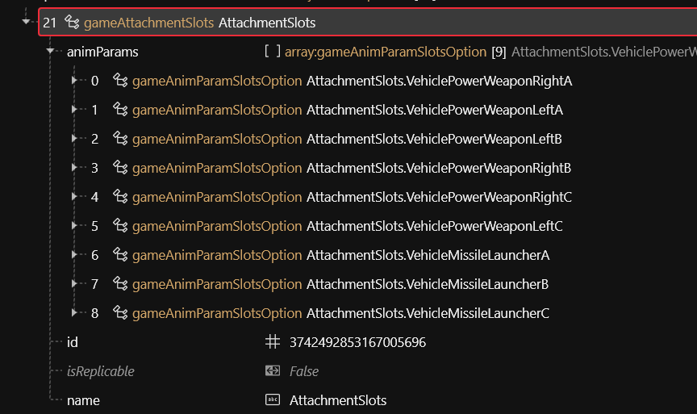
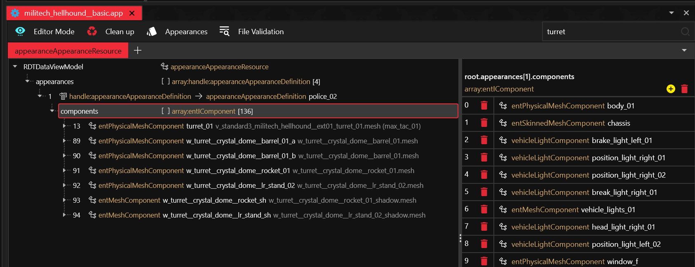
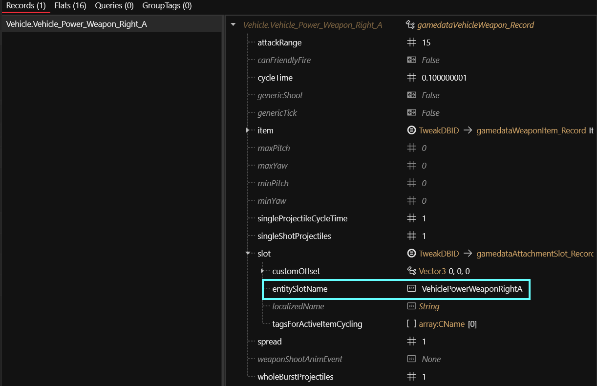

# Weaponizing vehicles

## Summary

Published: Mar 29 2025 by MisterChedda\
Last documented edit: Mar 30 2025 by [mana vortex](https://app.gitbook.com/u/NfZBoxGegfUqB33J9HXuCs6PVaC3 "mention")

This page will teach you how to turn a civilian car into a weaponized vehicle by copying the correct properties from a car that is already combat-ready.

### Wait, this is not what I want!

* Check [boe6s-guide-new-car-from-a-to-z](../boe6s-guide-new-car-from-a-to-z/ "mention") for how to add your own car from scratch
* Check [windows-and-doors-opening-+-mountedweapons-clue.md](windows-and-doors-opening-+-mountedweapons-clue.md "mention") for instructions on modifying the combat behaviour
* Check [vehicles.md](../../../for-mod-creators-theory/references-lists-and-overviews/vehicles/vehicles.md "mention") and the surrounding pages for a list of vehicle-related things that you might want to look up

## Prerequisites

* [ ] You have created a [Wolvenkit Project](https://app.gitbook.com/s/-MP_ozZVx2gRZUPXkd4r/wolvenkit-app/usage/wolvenkit-projects)
* [ ] You have a text editor such as [Notepad++](https://notepad-plus-plus.org/downloads/)
* [ ] You have Wolvenkit 8.16.2 (or a [Nightly](https://github.com/WolvenKit/WolvenKit-nightly-releases/releases) if that doesn't have released yet)

## Step 0: Add the reference files

Decide which car you want to ~~steal~~borrow the weapon from, then add its .ent and .app file to your project for easier reference (you can look them up on [vehicles.md](../../../for-mod-creators-theory/references-lists-and-overviews/vehicles/vehicles.md "mention")).&#x20;

For this project, we're using the Hellhound, and the corresponding files are

```
base\vehicles\standard\v_standard3_militech_hellhound__basic_01.ent
base\vehicles\appearances\standard\militech_hellhound__basic.app
```

These will be called "reference files" through the rest of the guide.

## Step 1: Changing the .ent file


This file is where your game looks up your car when spawning it from its record. You can learn more about [entity-.ent-files](../../../for-mod-creators-theory/files-and-what-they-do/file-formats/entity-.ent-files/ "mention") on the link, but you don't have to!


### 1. Changing the car's type

We need to change your car's type to a weaponized vehicle. Here's how we do that:

1. Open your car's `.ent` file and the reference file, and set the [editor difficulty mode](https://app.gitbook.com/s/-MP_ozZVx2gRZUPXkd4r/wolvenkit-app/editor/file-editor/editor-difficulty-mode) to "advanced".
2. Select `entity` in the reference file. Right-click and select "Copy Handle".
3.  Select `entity` in your car's file. Right-click and select "Paste as Handle".

    _This will only be available in Wolvenkit ≥ 16.2 or the Nightly. If you're on an older version, you'll have to do the edit via JSON._
4. Save the file (Hotkey: Ctrl+S)

### 2. Adding the weapon slots

1. In both files, open the `components` array and find the `vehicle_slots` component. It should be close to the top of the list.
2. In the reference file, scroll to the bottom of the list and find the `entSlot` entries corresponding to the car's weapons.
3. Select them, then right-click and copy the selection.
4. In your file, select either the list or an item in the list, and paste the selection here.
5. Save the file.

### 3. Adding the attachment slots

1. In the reference `.ent`, find the `gameAttachmentSlots`  component (it will probably be called `AttachmentSlots`).
2. Copy it and paste it into your .ent file

<figure><figcaption></figcaption></figure>

### 4. Adding the effect

1. In the reference file, search for **effect components**. Look for `entEffectSpawnerComponent` s. \
   In the hellhound, this is called `fx_explosion`.
2. Select and copy it.
3. Paste it into your car `.ent`'s `components` array.
4. Save the file.

## Step 2: Changing the tweak record


This file is used by TweakXL to make changes to the game's static database — for example, changing a car. If you want to learn more about tweak modding, you can check out [tweak-modding-guides.md](../../../for-mod-creators-theory/tweaks/tweak-modding-guides.md "mention"), but be vareful. This rabbit hole runs deep.


### 1. Adding the file

You can skip this step if you already have a yaml file.

1. In Wolvenkit's [Tweak Browser](https://app.gitbook.com/s/-MP_ozZVx2gRZUPXkd4r/wolvenkit-app/editor/tweak-browser), find the car's record that you want to change
2. Right-click and select "Add TweakXL override"
3. Do the same for the record that you're ~~stealing~~copying from.
4. In your project's [Resources section](https://app.gitbook.com/s/-MP_ozZVx2gRZUPXkd4r/wolvenkit-app/editor/project-explorer#resources), find the .yaml file and look at it. Then, delete all properties but the following:
   * `vehDataPackage`&#x20;
   * `weapons`  (your car might not have it)

### 2. Adding the weapons

1. Find the `weapons` array in your reference yaml and copy it to your own files.&#x20;
2. You can delete those entries that you don't want
3. Delete the reference yaml, you don't need it anymore!

### 3. Changing the combat behavior

Now, you'll have to tell your car that it's a weaponized vehicle. Do that by modifying the `vehDataPackage`. (Thanks to boe6 for pointing it out!)

You can do this in-line:&#x20;

```yaml
  vehDataPackage:   
    $base: Vehicle.VehicleDataPackageDefault
    driverCombat: DriverCombatTypes.MountedWeapons
```

## **Step 3: Changing the .app file**


This file is loaded by the .ent file, and contains an item's different appearances. You can learn more about [appearance-.app-files](../../../for-mod-creators-theory/files-and-what-they-do/file-formats/appearance-.app-files/ "mention") at the link, but you don't have to.


Open your car's `.app` file and the reference `.app` file.

### **1. Adding visual tags**

For **every appearance** in your .app file, you need to add the combat-related **visual tags** (you can ignore faction tags such as `Nomad` or `NCPD`).&#x20;

```
DualPowerWeaponPosA
MissileWeaponPosA
```


They look like this:

<figure><figcaption></figcaption></figure>

### 2. Adding the actual weapons

1. From your reference .app, find the weapon's mesh component(s) (you can for example filter for `turret`):

<figure><figcaption></figcaption></figure>

2. Copy them
3. Paste them into your own car's `.app` appearance(s)
4. Your car now has weapons.&#x20;

### 3. Adjusting the weapon positions


To find the right offsets, check [#placing-lights-and-effects](../../../for-mod-creators-theory/3d-modelling/custom-props/amm-light-components.md#placing-lights-and-effects "mention"). The process is the same here - although the offsets are finicky and you'll probably end up falling back to trial\&error.


You can adjust your wepaon's position relative to the car in two places:&#x20;

#### The weapon's origin

In the `.ent` file's `vehicle_slots` slot (Step [1.2](./#id-2.-adding-the-weapon-slots)), find the `relativePosition` and `relativeRotation` properties. These control where your rockets / your gunfire is coming from.

* In the mesh component that you just copied (Step [3.2](./#id-2.-adding-the-actual-weapons), `localTransform` property)

#### The weapon mesh's position

In the `.app` file inside the `ent(Physical)MeshComponent`s that you have copied:&#x20;

* change the `localTransform` property
* make sure that the `parentTransform` points at the bindName `vehicle_slots` and the slotName `Base`

#### If parts of your weapon mesh are disconnected and/or on the ground

That is becauuse they're rigged to a bone that your car does not have. The easiest way to fix this is to export their mesh into Blender and (in Edit mode) assign all weights to the first group.

You can check [weight-painting-for-gonks.md](../../../for-mod-creators-theory/3d-modelling/meshes-and-armatures-rigging/weight-painting-for-gonks.md "mention") for more detail about that.

## _Step 4: Making the weapons move_

_To be done_

## Step 5: Delete the reference files

Before you release your mod, do not forget to delete the reference files that you added in step 0. Never include files in your .archive that don't need to be there!

## Troubleshooting

### My guns are on the car, but nothing happens when I fire them!

That means you're missing the correct `entSlot`s.&#x20;

Check your `entSlotComponent`  (usually called `vehicle_slots`) and make sure that you have the vehicle slots corresponding to the weapons you added to your .yaml file.&#x20;


The spelling doesn't need to be the same!&#x20;


For example, the Shion has `Vehicle.Vehicle_Power_Weapon_Left_A`, but the entSlot is called `VehiclePowerWeaponLeftA`. This is defined in the tweak record:

<figure><figcaption></figcaption></figure>
