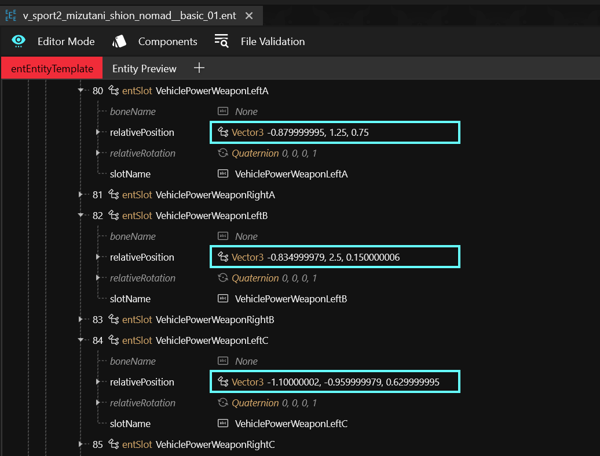
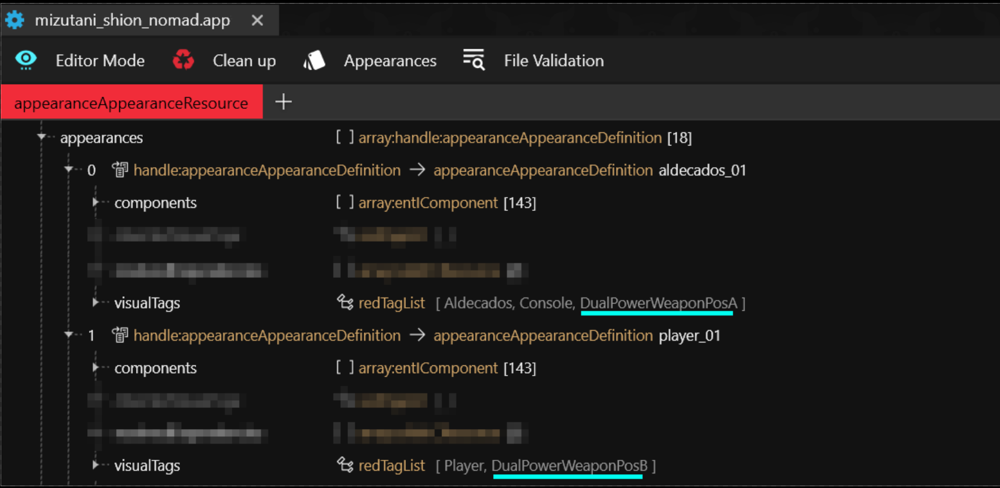

# Vehicle Weapon Variants (A, B, C)

## Summary

**Published:** Aug 24 2025 by [mana vortex](https://app.gitbook.com/u/NfZBoxGegfUqB33J9HXuCs6PVaC3 "mention") based on research by [oranje3.interactive](https://app.gitbook.com/u/WmuhC8ydOkY9iXg8LizCbfpsUdA3 "mention")\
**Last documented update**: Aug 24 2025 by [mana vortex](https://app.gitbook.com/u/NfZBoxGegfUqB33J9HXuCs6PVaC3 "mention")&#x20;

This guide will teach you how to use different variants for vehicle guns on the example of the **Mizutani Shion**.

## Wait, that's not what I want!

* To learn more about [.](./ "mention"), check the corresponding wiki page.
* If you want to create different appearances for player weapons, check [weapons](../../items-equipment/adding-new-items/weapons/ "mention")

## Different positions

The guns are positioned via the `relativePositions` of their `entSlot`s (find the `entSlotComponent` called `vehicle_slots` in the `.ent` file):

<figure><figcaption></figcaption></figure>

Read on to find out how to pick the variant.

## Positioning weapons

You assign the weapon variant via `visualTags` in the `.app` file (they must correspond by name to entries in the `vehicle_slots` component).


`DualWeaponPosA` will assign the power weapons to `ehiclePowerWeaponRightA` and `VehiclePowerWeaponLeftA`.


<figure><figcaption></figcaption></figure>

## Weapon appearances

By using different appearances with their own components, you can pick different appearances and chunkmasks per component. You can read more about this under [#material-assignment](../../../for-mod-creators-theory/files-and-what-they-do/file-formats/3d-objects-.mesh-files/#material-assignment "mention").
