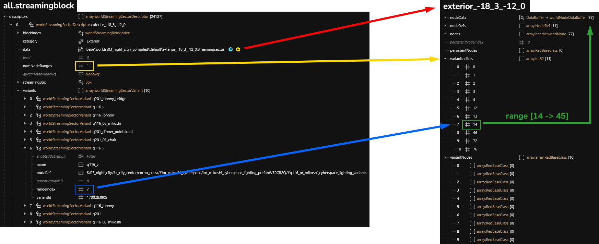
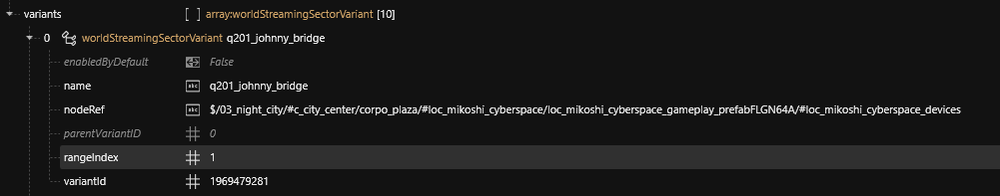

# Switching between sector states


This page contains the theory of sector variants, for creating sectors with variants, head over to the [Creating Sector Variants](../object-spawner/features-and-guides/creating-sector-variants.md) guide


## Summary

**Published:** Jan 07 2025 by [Sergey](https://app.gitbook.com/u/N691cVEMA0Nmecc6QHIAM73aI0z1 "mention")\
**Last documented edit:** Jan 08 2025 by [manavortex](https://app.gitbook.com/u/NfZBoxGegfUqB33J9HXuCs6PVaC3 "mention")

This page will show you how to switch sector states.

### Wait, this is not what I want!

* To learn more about `.streamingsector` files, check [the-whole-world-.streamingsector](../../../for-mod-creators-theory/files-and-what-they-do/file-formats/the-whole-world-.streamingsector/ "mention")&#x20;
* To learn about `.streamingblocks`, check [.streamingblock-sector-definitions-and-variants.md](../../../for-mod-creators-theory/files-and-what-they-do/file-formats/the-whole-world-.streamingsector/.streamingblock-sector-definitions-and-variants.md "mention")
* For a list of node types, check [reference-.streamingsector-node-types.md](../../../for-mod-creators-theory/references-lists-and-overviews/reference-world-sectors/reference-.streamingsector-node-types.md "mention")
* check [..](../ "mention") -> [adding-locations-and-structures-with-archivexl.md](adding-locations-and-structures-with-archivexl.md "mention") if that's what you'd rather do

### World state variants

Here is an overview of file relations between `.streamingsector` and -`block`:

<figure><figcaption></figcaption></figure>

### Streamingblock

The game contains only 3 streamingblocks that gather more than 26300 sectors.\
We will focus on the main one and take a look at the first sector inside (`exterior_-18_3_-12_0`).


When creating a mod with sectors, you will need to create your own block that will list your new sectors.


<figure><figcaption></figcaption></figure>

This sector has 10 variants, in this case, each one is related to a quest state.

`numNodeRanges` indicate the number of node ranges the sector contains; it always corresponds to the number of variant + sector's default range (so here 10 variants + 1 default).

When opening a variant definition, we can find the range index (to find the right range inside the sector file). `rangeIndex` cannot be 0, 0 is used as sector's default range.

Variant's name is only used to identify the variant within the streamingblock.

<figure><figcaption></figcaption></figure>


The link between quests and sectors' variants is not well-researched as of Jan 2024 - if you know anything more about this, please get in touch via [Discord](http://discord.gg/redmodding) or update the wiki!


### Defining a new variant

In the [.streamingsector file](../../../for-mod-creators-theory/files-and-what-they-do/file-formats/the-whole-world-.streamingsector/), add a new entry in each of these lists:&#x20;

* [variantIndices](../../../for-mod-creators-theory/files-and-what-they-do/file-formats/the-whole-world-.streamingsector/#variantindices)
* [variantNodes](../../../for-mod-creators-theory/files-and-what-they-do/file-formats/the-whole-world-.streamingsector/#variantnodes)

## How to trigger a switch

To trigger a switch between sector states, you can use &#x20;

* .questphase files
* [Codeware](https://github.com/psiberx/cp2077-codeware/wiki#controlling-prefabs-and-variants) via redscript/CET
