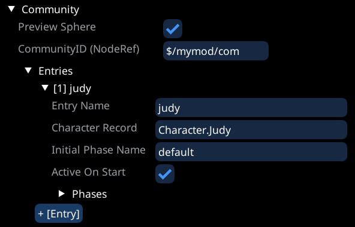
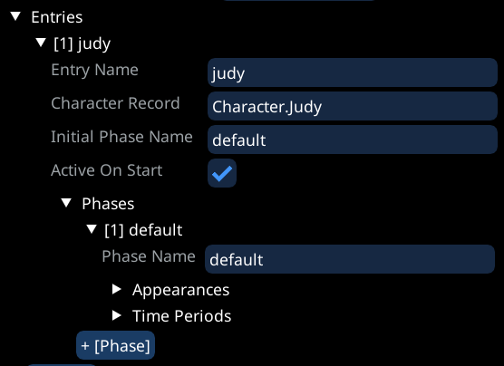
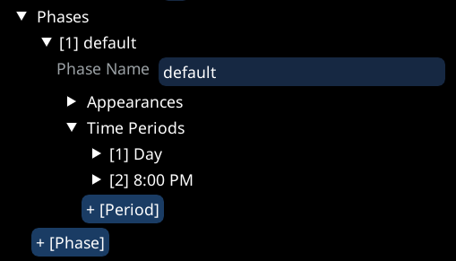
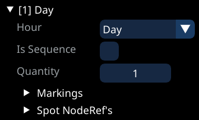
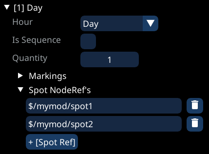
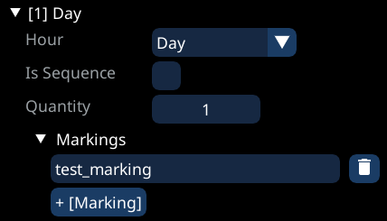
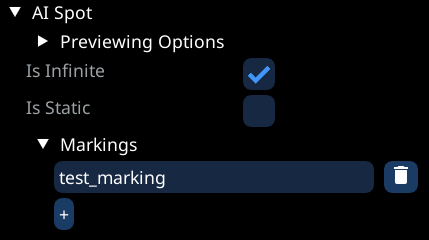
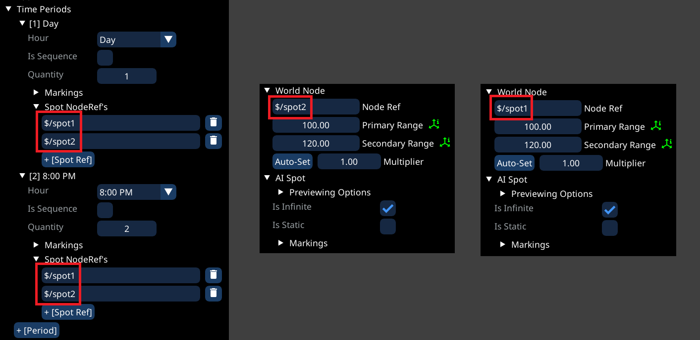
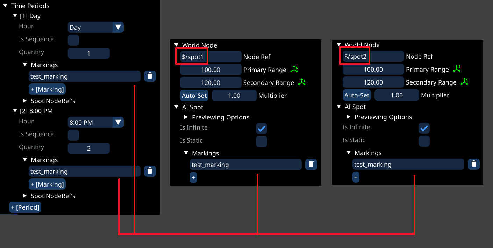

# Creating Communities

## Usage

* Communities are used to spawn almost all NPCs that aren't crowd NPCs
* As the name suggests, communities can be used to add large amounts of NPCs to the world while retaining a lot of control over:
  * What NPCs to spawn
  * Where those NPCs should be, what workspots they should use
  * What they should do during what time of day

## Requirements

### Tools

* [Object Spawner](https://github.com/justarandomguyintheinternet/CP77_entSpawner/releases) (v.0.91 or newer)
* [ArchiveXL](https://github.com/psiberx/cp2077-archive-xl)
* [Codeware ](https://github.com/psiberx/cp2077-codeware/releases)(1.15.0 or newer)
* [WolvenKit](https://github.com/WolvenKit/WolvenKit) (With latest version of Object Spawner import script)

### Knowledge

* You need to have a basic understanding of:
  * Working with WolvenKit
  * Using Object Spawner (Spawning things and [importing](exporting-from-object-spawner.md) into WolvenKit)
  * Know how to place `AISpot`'s, see the [corresponding page](placing-aispot-nodes.md)

## General Setup

* Each community can serve a large area
  * How many NPCs and how much of an area you serve with a single community is up to you, but it is generally recommended to have one community per location
* Start by spawning a community, found under `AI -> Community`
  * The community should be placed in the rough area of where the AISpots that you want to use are


Make sure to assign a unique NodeRef to the community (Is the same as the `Community ID`)


* In general, a community consists of the following hierarchical data:
  * Entries:
    * Each entry corresponds to one **NPC template**, e.g. Judy or some generic NPC
    * Phases:
      * Phases are **used by quests**, to switch between different setups
      * They are not of interest if you just want to place some NPCs without quests involved
      * Periods:
        * Periods define **how many NPCs** should be placed **where**, per **time period**


To delete an entry, phase or period, simply right click its header


### Setting up an entry

* Let's start by making our community spawn a NPC, do this by adding a new entry under the `Entries` header

<figure><figcaption>
Example of a community with a single entry
</figcaption></figure>

* Here you can define a name for the entry, make sure it is unique
* Here you can also define what NPC template should be used
* Initial Phase Name and Active On Start are only of interest for quest modding, so ignore those for now

### Setting up a phase

* For our example, we will only need one phase, named `default`
* As before, use the `+ [Phase]` button to create a new phase for our entry

<figure><figcaption>
Example of an entry with a single default phase
</figcaption></figure>

* Here you can also define what appearances the NPCs of that entry should use
  * Do this by adding more names under the appearances header
  * This is totally optional, and the default will do

### Setting up periods

* This defines how many of the specified NPC should be spawned, where they should be spawned, and **when** they should be spawned
* As before, use the `+ [Period]` button to create a new period for our phase
* For this example, let's create two periods

<figure><figcaption>
Example phase with two time periods
</figcaption></figure>

*   Each period has the following options:

    * Hour: This controls when the period is active
      * E.g. If you have two periods, `8:00 PM` and `Day`, then from 8:00 PM until 9:00 AM (That's the start of `Day`), the `8:00 PM` period will be active, from 9:00 AM until 8:00 PM, the `Day`period will be active
    * Is Sequence: Only relevant if the AISpots are not set to be infinite. If checked, the NPCs will cycle through the specified spots in the same order as they are listed
    * Quantity: How many of the specified NPC should be spawned
    * Markings and Spot NodeRefs: This is where you actually define what AISpot's should be used, will be explained in the following section

    <figure><figcaption>
The properties of a time period
</figcaption></figure>

## Markings and Spot NodeRef's

### Spot NodeRef's

* This list defines what AISpot's the NPCs from that time period can use
* Make sure that you have enough spots for the amount of NPCs
* Simply add the NodeRefs of the AISpots that you want to be used during this time period

<figure><figcaption>
Example of making the NPC of the "Day" period use one of the two defined AISpots
</figcaption></figure>

### Markings

* Markings allow you to simply tell the NPCs "Use any of the AISpots that have this marking"
  * You can think of a marking as a Tag that you assign to AISpots
* This makes it very easy to assign many NPCs to a large amount of AISpots, randomly
*   E.g.

    * Assign the marking `test_marking` to all AISpots that you want to be used
    * Add that same `test_marking` name to the list of markings of the period

    <figure><figcaption>
Example of making a time period use all AISpots with the marking "test_marking"
</figcaption></figure>

    <figure><figcaption>
Example of marking an AISpot, should be done to a group of multiple spots
</figcaption></figure>

    ## Full example with SpotNodeRef's
* This is a full example of having either one or two Judy's spawn in specified spots, depending on the time

<figure><figcaption></figcaption></figure>

## Full example using markings

* Using markings is especially worth it for larger amounts of NPCs and spots

<figure><figcaption></figcaption></figure>
