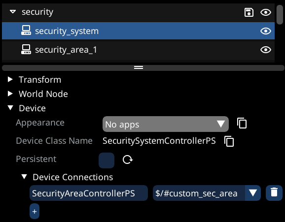
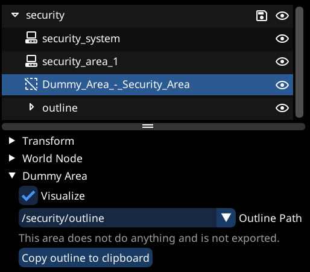
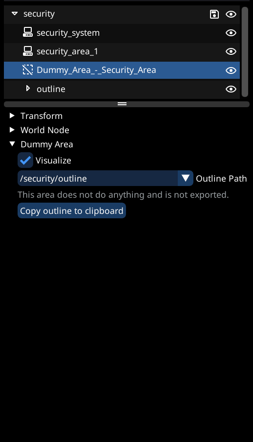

# Creating Security Areas

## Usage

* Security areas serve two main purposes:
  * Makes the minimap say "Safe/Restricted/Hostile"
  * As an area in which specific player actions alert connected hostiles, as well as providing connectivity between devices and community NPCs (Such that pinging one enemy / device pings all devices and NPCs)

## Requirements

### Tools

* [Object Spawner](https://github.com/justarandomguyintheinternet/CP77_entSpawner/releases) (v.0.97 or newer)
* [ArchiveXL](https://github.com/psiberx/cp2077-archive-xl)
* [Codeware ](https://github.com/psiberx/cp2077-codeware/releases)(1.15.0 or newer)
* [WolvenKit](https://github.com/WolvenKit/WolvenKit) (With latest version of Object Spawner import script)

### Knowledge

* You need to have a basic understanding of:
  * Working with WolvenKit
  * Using Object Spawner (Spawning things and [importing](exporting-from-object-spawner.md) into WolvenKit)

## Spawning the nodes

* In order to have a functional security area, you need two things:
  * A security system, linked to the security area
  * A security area, defining the area outline and type


Make sure to spawn both as `Device`(`Entity -> Device` in Object Spawner)


* Security system:
  * Spawn a `base\gameplay\devices\security_systems\security_system.ent`
  * Assign a unique NodeRef
* Security area:
  * Spawn a `base\gameplay\devices\security_systems\security_area\security_area_1.ent`
  * Assign a unique NodeRef
  * **Ensure that it has no rotation**, so set roll, pitch and yaw to 0

## Linking the devices

* Next we need to link the security system to the area
* To do this, we will go to the `Device -> Device Connections` header of the security system, add a new entry
* Fill the device class name field (On the left), with the device class name of the security area
  * In our case this would be `SecurityAreaControllerPS`, which can also be found under the device header of the security area
* Select the NodeRef of the security area on the right hand side of the entry

<figure><figcaption>
The security system is now linked to our security area (The device connection has the device class name and NodeRef of the security area)
</figcaption></figure>

## Creating the outline

* Next we want to create the outline of the security area
* In order to do this, setup a `Dummy Area`, using the [guide for setting area outlines](setting-area-outlines.md) (Use a `Dummy Area` as area type)


Ensure that the `Dummy Area` is in the exact same position as our security area device


* Next, press the `Copy outline to clipboard` button, found in the Dummy Area

<figure><figcaption>
Dummy area outline, linked to an outline group as described in the outlines guide
</figcaption></figure>

## Setting the outline

* Now, we want our security area device to use our previously defined (And copied to clipboard) area outline
* Open the `Entity Instance Data` header of the security area
* Locate the `area` component, and expand it
*   Right-click the `outline` header, and select `Paste outline [Number of outline markers]`

    <figure><figcaption>
How to copy and paste the outline
</figcaption></figure>

## Setting area type

* By default, the area will be `Hostile`
* To change this, under the entity instance data header, locate:
  * `controller -> persistentState -> securityAreaType`
  * There you can select the type of area you want

## Recap

* You should now have:
  * A security system and security area, spawned as device
  * Both have unique NodeRefs
  * Security system has a device connection to the security area
  * Dummy outline, copy pasted the outline into the security area
* Now simply export your group from Object Spawner, and import into WKit using the Object Spawner [import feature](exporting-from-object-spawner.md)
