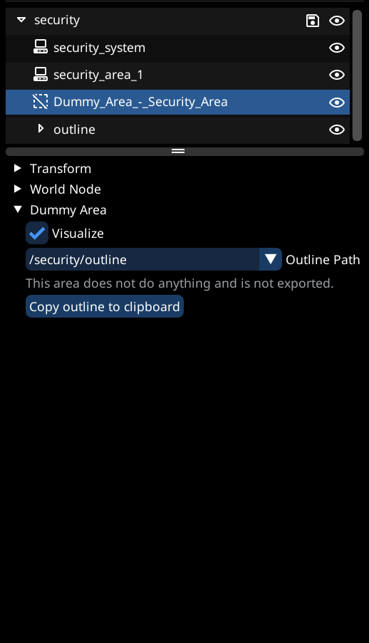

# Security System

## Summary

**Published: keanuWheeze**

**Last documented update: Sept. 12 2026 by** [**Akiway**](https://github.com/Akiway)

### Usage

* A security system is the brain. On its own it does nothing visible; its task is to connect and synchronize every part of the system together :
  * The different area types "Safe / Restricted / Hostile"
  * The communities containing the NPCs that are part of the faction concerned by this security system
  * The devices that detect, alert and attack the intruders
* The system holds what is shared across those areas: the faction it fights for, whether the areas show on the minimap, the access-code tiers, and how long an alerted network waits before resetting.
* One system can own several areas, commmunties and devices.

### Requirements

#### Tools

* World Builder ([official](https://github.com/justarandomguyintheinternet/CP77_entSpawner/releases) ≥ 0.97 or newer, or [Akiway's fork](https://github.com/Akiway/CP77_entSpawner/releases/latest) ≥ a.1.5.0)
* [ArchiveXL](https://github.com/psiberx/cp2077-archive-xl)
* [Codeware ](https://github.com/psiberx/cp2077-codeware/releases)(1.15.0 or newer)
* [WolvenKit](https://github.com/WolvenKit/WolvenKit) (With latest version of World Builder import script)


[Akiway's fork of World Builder](https://github.com/Akiway/CP77_entSpawner/releases/latest) is a more advanced version that put the focus on **Quality of Life**.

The version **a.1.5.0** brings a new **Quick Security System Setup** feature that helps you to build and manage your network in a single popup : system, areas, outlines, communities and driven devices.


#### Knowledge

* You need to have a basic understanding of:
  * Working with WolvenKit
  * Using World Builder (Spawning things and [importing](../object-spawner/exporting-from-object-spawner.md) into WolvenKit)

## Creating the security system



### Quick Setup in video

_Video coming soon..._

#### What the quick setup does for you

* The quick setup writes each entry **whole**
* It spawns the appropriate devices
* Devices are automatically configured
* It handles the links between area ↔ security system ↔ devices



### **1. Spawning the security system**

1. In the [<mark style="color:purple;">Asset Browser</mark>](#user-content-fn-1)[^1] <i class="fa-square-plus" style="color:purple;">:square-plus:</i>, search for an object of type <mark style="background-color:blue;">**Entity**</mark> and variant <mark style="background-color:blue;">**Device**</mark>.
2. Filter the results by [<mark style="color:purple;">Device Class Name</mark>](#user-content-fn-2)[^2] and select <mark style="background-color:blue;">**SecuritySystemControllerPS**</mark>.
3. Spawn `base\gameplay\devices\security_systems\security_system.ent` and place it somewhere you will remember.


**You will not see anything appear.** The security system has no model. Put it near the area it will watch so it is easy to find again in the object list.




### **2. Opening the panel**

In the security system's properties, click the <mark style="color:purple;">Quick Security System Setup</mark> button.


The same button appears on a **security area** (<mark style="background-color:blue;">**SecurityAreaControllerPS**</mark>) and opens the same network. If that area has no system yet, the panel says so and offers a <mark style="color:purple;">Create system</mark> button that spawns one beside it and points it back at the area.


First, give the system a unique [<mark style="color:purple;">node ref</mark>](#user-content-fn-3)[^3] <i class="fa-hashtag" style="color:purple;">:hashtag:</i> : type your own, or use the [<mark style="color:purple;">generate button</mark>](#user-content-fn-4)[^4] <i class="fa-rotate-exclamation" style="color:purple;">:rotate-exclamation:</i>. Areas, communities and devices all connect to this NodeRef, and the `.psrep` entry is keyed on it.

#### **The network graph**

<figure><figcaption>
Network graph
</figcaption></figure>

* **Areas** sit above the system, each showing its type, click the <mark style="color:orange;">orange</mark> <i class="fa-square-plus" style="color:orange;">:square-plus:</i> button to add one
* **Communities** sit to the right, click the <mark style="color:green;">green</mark> <i class="fa-square-plus" style="color:green;">:square-plus:</i> button to add one
* **Driven devices** sit below, click the <mark style="color:pink;">pink</mark> <i class="fa-square-plus" style="color:pink;">:square-plus:</i> button to add one
* Click any node in the graph to edit it underneath the graph
* Right-click on a node to delete it or unlink it from the system
* Right-click on the graph to open the context menu to add a node



### **3. System settings**

<table><thead><tr><th width="154">Setting</th><th>What it does</th></tr></thead><tbody><tr><td><strong>Faction</strong></td><td>The <code>Attitudes.Group_*</code> this system fights for: it decides who counts as an intruder and who gets alerted</td></tr><tr><td><strong>Attitude</strong></td><td><code>Persistent</code> keeps a provoked faction hostile after the fight, <code>Temporary</code> lets it settle back. <strong>Lock</strong> freezes it</td></tr><tr><td><strong>Minimap</strong></td><td><em>Hide areas on minimap</em> suppresses the Safe/Restricted/Hostile overlay for every area on the system</td></tr><tr><td><strong>Auto Reset</strong></td><td>How long an alerted system waits before resetting itself. All zero means never</td></tr><tr><td><strong>Breach</strong></td><td>Breach protocol difficulty for the network. <em>Can stand down</em> lets the system disable itself once its areas go Disabled</td></tr><tr><td><strong>Device State</strong></td><td>The state the system starts in</td></tr><tr><td><strong>Access Codes</strong></td><td>Five tiers of passwords and keycards. An area picks one tier as its Access Level; a code in that tier authorizes against it</td></tr></tbody></table>


A `Dangerous` or `Safe` area under a system with **no faction** has nobody to turn hostile or protective. The panel flags it and offers `Attitudes.Group_Hostile`, which is one of the three groups the controller branches on by name.




### **4. Adding an area**

Click the <mark style="color:orange;">orange</mark> <i class="fa-square-plus" style="color:orange;">:square-plus:</i> button on the area row. It spawns:

* A `security_area_1.ent` at the system's position, marked as persistent.
* An `outline` group of four markers around it, about 4 m out and 6 m high, already bound to the area
* The `SecurityAreaControllerPS` connection on the system, pointing at the new area's [<mark style="color:purple;">generated NodeRef</mark>](#user-content-fn-4)[^4] <i class="fa-rotate-exclamation" style="color:purple;">:rotate-exclamation:</i>

Then drag the markers into the shape you want. The trigger volume follows them.


The <mark style="color:purple;">Outline</mark> row tells you what the volume currently is (eg. `4 markers | 6.00 m high`).\
Watch for:

* **Not bound** : the area falls back to the entity's own 8×8 m box
* **Fewer than 3 markers** : not a volume at all
* **Height 0** : the volume is flat, so nothing can ever be inside it


#### **Area settings**

<table><thead><tr><th width="150">Setting</th><th>What it does</th></tr></thead><tbody><tr><td><strong>Type</strong></td><td><code>Disabled</code> (inert) <code>Safe</code> (the system protects the player) <code>Restricted</code> (trespassing is illegal, not lethal) <code>Dangerous</code> (shoot on sight). ⇒ New areas start <code>Restricted</code></td></tr><tr><td><strong>Zone Name</strong></td><td>What <code>GetSecurityAreaData()</code> reports as the zone name</td></tr><tr><td><strong>Access Level</strong></td><td>Which of the system's five code tiers this area demands, or <code>None</code></td></tr><tr><td><strong>Events</strong></td><td><code>in</code> = what the area accepts from the rest of the network <code>out</code> = what it reports back</td></tr><tr><td><strong>Device State</strong></td><td>The state the area starts in (<code>ON</code> / <code>OFF</code> / <code>DISABLED</code>)</td></tr><tr><td><strong>Schedule</strong></td><td>Times of day the area changes type on its own</td></tr></tbody></table>

#### **Schedule**

You can configrue the area type hour by hour. Add as many transitions as you want.

<figure><figcaption>
Hour-by-hour schedule
</figcaption></figure>


A schedule row is one whole hour and one type: _at 22:00 → Dangerous_. A common pattern is **Disabled by day, Dangerous at night**.




### **5. Adding communities and devices**

* Click the <mark style="color:green;">green</mark> <i class="fa-square-plus" style="color:green;">:square-plus:</i> button on the community row to spawn a community node and wires it with a `CommunityProxyPS` connection, so its NPCs get alerted.
* Click the <mark style="color:pink;">pink</mark> <i class="fa-square-plus" style="color:pink;">:square-plus:</i> button on the device row to spawn a **surveillance camera**, **security turret** (ceiling or mounted), **security alarm**, **proximity detector**, **access point** or **security gate**. Each is spawned, NodeRef'd and connected under its own controller class.


Already spawned something by hand? Use <mark style="color:purple;">Add existing node to network</mark> at the bottom of the system panel to link a community or device by NodeRef.



Selecting a driven device in the graph exposes its own settings (state, backdoor and quickhacks for everything are common to all).







### Spawning the nodes

* In order to have a functional security area, you need two things:
  * A security system, linked to the security area
  * A security area, defining the area outline and type


Make sure to spawn both as `Device`(`Entity -> Device` in World Builder)


* Security system:
  * Spawn a `base\gameplay\devices\security_systems\security_system.ent`
  * Assign a unique NodeRef
* Security area:
  * Spawn a `base\gameplay\devices\security_systems\security_area\security_area_1.ent`
  * Assign a unique NodeRef
  * **Ensure that it has no rotation**, so set roll, pitch and yaw to 0



### Linking the devices

* Next we need to link the security system to the area
* To do this, we will go to the `Device -> Device Connections` header of the security system, add a new entry
* Fill the device class name field (On the left), with the device class name of the security area
  * In our case this would be `SecurityAreaControllerPS`, which can also be found under the device header of the security area
* Select the NodeRef of the security area on the right hand side of the entry

<figure><figcaption>
The security system is now linked to our security area (The device connection has the device class name and NodeRef of the security area)
</figcaption></figure>



### Creating the outline

* Next we want to create the outline of the security area
* In order to do this, setup a `Dummy Area`, using the [guide for setting area outlines](../object-spawner/features-and-guides/setting-area-outlines.md) (Use a `Dummy Area` as area type)


Ensure that the `Dummy Area` is in the exact same position as our security area device


* Next, press the `Copy outline to clipboard` button, found in the Dummy Area

<figure><figcaption>
Dummy area outline, linked to an outline group as described in the outlines guide
</figcaption></figure>



### Setting the outline

* Now, we want our security area device to use our previously defined (And copied to clipboard) area outline
* Open the `Entity Instance Data` header of the security area
* Locate the `area` component, and expand it
*   Right-click the `outline` header, and select `Paste outline [Number of outline markers]`

    <figure><figcaption>
How to copy and paste the outline
</figcaption></figure>



### Setting area type

* By default, the area will be `Hostile`
* To change this, under the entity instance data header, locate:
  * `controller -> persistentState -> securityAreaType`
  * There you can select the type of area you want



### **Linking the community**

* If your security area should alert NPCs in your custom community, you also need to link the security area to the community
* Open the Device -> Device Connections header of the security area, and add a new entry
* Fill the device class name field with: `CommunityProxyPS` and select the NodeRef of your Community node
* **Important: ensure your community, security area, and security system are all in the same group.** Otherwise the device connection may not be linked properly on Wolvenkit import





## Recap

* You should now have:
  * A security system and security area, spawned as device
  * Both have unique NodeRefs
  * Security system has a device connection to the security area
  * Security area has a device connection to the community
  * Dummy outline, copy pasted the outline into the security area
* Now simply export your group from World Builder, and import into WKit using the World Builder [import feature](../object-spawner/exporting-from-object-spawner.md)

[^1]: The Asset Browser allows to spawn new assets. you can access it from the [Spawn New tab](https://wiki.redmodding.org/cyberpunk-2077-modding/modding-guides/world-editing/object-spawner/ui-tabs-explained/tab-spawn-new).

[^2]: A device class defines the entity's properties as well as its behavior and connections to the game's systems.

[^3]: **A node reference is an unique identifier**, it is not a path.\
    To avoid modding conflicts, make sure to set a ref that follows a pattern of your own.\
    Example : `#/author/modName/group/#myObjectidentifier`

[^4]: <mark style="color:purple;">Auto-generation</mark> <i class="fa-rotate-exclamation" style="color:purple;">:rotate-exclamation:</i> uses the current group structure and element name to create a node ref. The reference unicity cannot be guaranteed with the other mods, so it is recommended to set a custom value.
