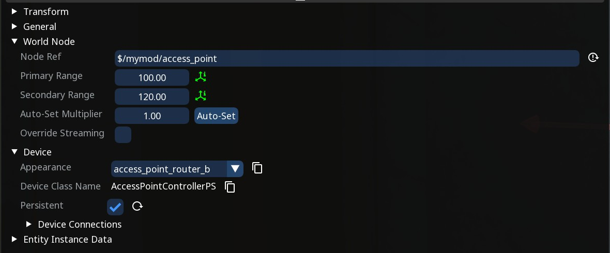
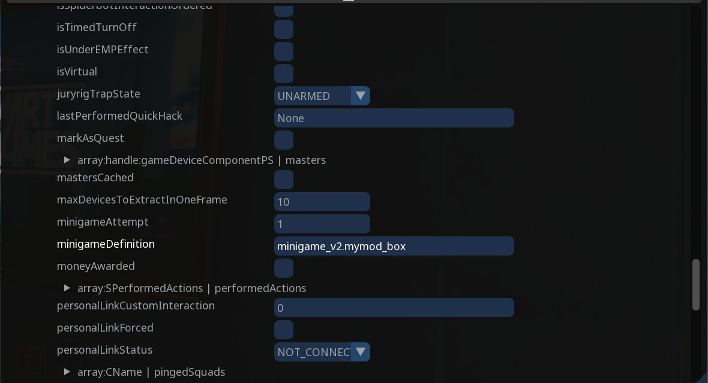
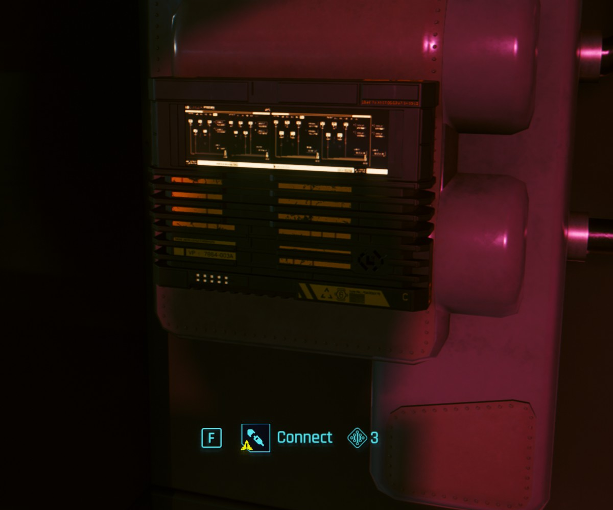

# Custom Access Points

## Summary

The access point is a small box with the "Connect" prompt. Connecting to it (F) opens the _breach protocol_ minigame. This guide covers placing a vanilla box with World Builder, putting your own daemon on its grid, and getting the result into a quest fact.

Applies to game version 2.31.

### Wait, this is not what I want!

* For a readable note or shard, check out [Creating custom shards](/broken/pages/c0a43262dc2f2fd99a257e83b47b5203a063f18c)
* For a device that does something when used, check out [Device operations container](/broken/pages/81b3fa470bc7d9a90e475f60aeaa7ebc93d111bc)

## Requirements

### Tools

* [World Builder](https://github.com/justarandomguyintheinternet/CP77_entSpawner/releases)
* [WolvenKit](https://github.com/WolvenKit/WolvenKit) (with the latest version of the World Builder import script)
* [ArchiveXL](https://github.com/psiberx/cp2077-archive-xl)
* [TweakXL](https://github.com/psiberx/cp2077-tweak-xl)
* [redscript](https://github.com/jac3km4/redscript) and [RED4ext](https://github.com/WopsS/RED4ext)

### Knowledge

* You need to have a basic understanding of:
  * Using World Builder (spawning things and [importing](/broken/pages/b034d8ec8bbc6a7cea6b1262890e17d0de5500e6) into WolvenKit)
  * Creating tweaks using TweakXL (`.yaml` files)
  * redscript
  * (optional) a `ScriptableSystem` for changing the Intelligence requirement
  * Quest facts
* You will also need a translation file for the daemon's name and description (see [Translation files: .json](/broken/pages/c4e744104eb7cfcc3d3a1e8ee8116768ae781c87))


The NodeRef, the `mymod` record names and the fact name in this guide are _examples_, do not use the same ones as in the guide.


## TweakXL setup

Each breach protocol game refers to a list of daemons, which are basically the patterns you need to solve.

So you can customise your access point with your own list. Most vanilla gigs that interact with the breach protocol game only require one daemon, so we'll do the same here.

You can choose name and description for the daemon, to make it relevant to the action in your quest.

For example:

```yaml
Interactions.mymod_access_data:
  $base: Interactions.NetworkDataMineLootQ003
  caption: LocKey#mymod_daemon_name
  description: LocKey#mymod_daemon_desc

MinigameAction.mymod_access_data:
  $base: MinigameAction.NetworkLootQ003
  objectActionUI: Interactions.mymod_access_data

minigame_v2.mymod_box_inline0:
  $base: minigame_v2.Kab08Minigame_inline0
  program: MinigameAction.mymod_access_data

minigame_v2.mymod_box:
  $base: minigame_v2.Kab08Minigame
  overrideProgramsList:
    - minigame_v2.mymod_box_inline0
```

Place this in a new `.yaml` file inside `Cyberpunk 2077\r6\tweaks`.

`minigame_v2.Kab08Minigame` is a vanilla list with a single daemon on it, which is why the two `minigame_v2` records copy it.

The caption and description are the daemon's name and text shown during the minigame. They come from your translation file: a `.json` made in WolvenKit with one entry per string, registered in your `.xl` file as [Translation files: .json](/broken/pages/c4e744104eb7cfcc3d3a1e8ee8116768ae781c87) shows. The two entries for this daemon:

| femaleVariant                           | primaryKey | secondaryKey        |
| --------------------------------------- | ---------- | ------------------- |
| `DATAMINE: CLIENT LIST`                 | `0`        | `mymod_daemon_name` |
| `Copy the client list off the network.` | `0`        | `mymod_daemon_desc` |

The yaml refers to each entry by its `secondaryKey`, with `LocKey#` in front.

## Spawning the access point

The box is placed with World Builder. Load a save, stand where the box should go, open CET with your custom key binding, and open the World Builder window.

1. Go to the `Spawn New` tab. Set the object type to `Entity` and the variant to `Device`.
2. Search for `accesspoint` and click `base\gameplay\devices\masters\access_points\accesspoint.ent`. The box spawns in front of you.
3. Go to the `Spawned` tab and click the `accesspoint` entry. Its properties open in the bottom half of the window.
4. Under `Transform`, move it onto your wall.
5. Under `World Node`, set the NodeRef to something unique, e.g. `$/mymod/access_point`. This id is used later in the script, so take note of it.
6. Under `Device`, set the appearance to `access_point_router_b` and tick `Persistent`. The box needs the NodeRef from step 5 first.

<figure><figcaption><p>NodeRef set, appearance chosen and Persistent ticked</p></figcaption></figure>


If the "Connect" prompt doesn't appear in game, turn the box 180 degrees and try again.


## Setting up instance data

Now connect the box to the daemon list created in the previous steps.

1. Expand `Entity Instance Data`.
2. Inside it, expand `AccessPointController`, then `persistentState`.
3. Set `minigameDefinition` to your list, `minigame_v2.mymod_box`.
4. Leave everything else in there as it is.

<figure><figcaption><p>The list is long; minigameDefinition is about two thirds of the way down</p></figcaption></figure>

## Saving the group

World Builder only saves what is inside a group.

1. At the top of the `Spawned` tab, type a name for the group in the box next to `Add group`, e.g. `mymod`, and click `Add group`.
2. Drag the `accesspoint` entry onto the group.
3. Press `Ctrl+S` to save.

## Finishing up

* You should now have the following:
  * A `.yaml` tweak file containing the daemon records
  * A World Builder group containing the access point, spawned as `Device`, set to be persistent, with its own NodeRef and its instance data pointing at your list
* Now export your group from World Builder, and import into WolvenKit using the World Builder [import feature](/broken/pages/b034d8ec8bbc6a7cea6b1262890e17d0de5500e6)


The box's settings are stored in the save the first time the game loads it. If you change them after that, test on a save that has not been near the box.


## Reading the breach

Some simple scripting is needed in order to retrieve the information of when the player successfully completed the minigame.

Wrap the method the game calls when the minigame closes, and set your fact from there. This fires for every access point in the city, so filter it by NodeRef with the id previously set in World Builder. The redscript goes in a `.reds` file under `Cyberpunk 2077\r6\scripts\<your mod>\`:

```swift
// the NodeRef from World Builder, resolved to the box's entity id
public static func MyModBoxId() -> EntityID {
  return Cast<EntityID>(ResolveNodeRef(
    CreateNodeRef("$/mymod/access_point"),
    Cast<GlobalNodeRef>(GlobalNodeID.GetRoot())));
}

@wrapMethod(AccessPointControllerPS)
public func FinalizeNetrunnerDive(state: HackingMinigameState) -> Void {
  wrappedMethod(state);
  if Equals(state, HackingMinigameState.Succeeded)
    && PersistentID.ExtractEntityID(this.GetID()) == MyModBoxId() {
    GameInstance.GetQuestsSystem(this.GetGameInstance()).SetFactStr("mymod_ap_breached", 1);
  }
}
```

Wait on `mymod_ap_breached` in your quest phase.

## Optional: the Intelligence requirement

Each breach protocol game has an Intelligence required level. The game picks the level, and it can come out as high as 10. If the box is meant to be a real obstacle, leave it. If every character has to be able to open it independently of their character build, set the requirement to 3, which is the lowest possible.

Once `TrySetRequiredLevel` has stored a level, the game uses that instead of generating one.

This is easily done with two methods added to the game's classes:

```swift
// Store an Intelligence requirement of 3 on the box, so any character can
// open it. The game ignores the write once a level is stored,
// so repeated calls do nothing.
@addMethod(AccessPointControllerPS)
public func MyModEaseBreach() -> Bool {
  let container: ref<BaseSkillCheckContainer> = this.GetSkillCheckContainer();
  if !IsDefined(container) {
    return false;
  }
  let slot: ref<HackingSkillCheck> = container.GetHackingSlot();
  if !IsDefined(slot) {
    return false;
  }
  let check: ref<GameplaySkillCondition> = slot.GetBaseSkill();
  if !IsDefined(check) {
    return false;
  }
  let before: Int32 = check.GetRequiredLevel(this.GetGameInstance());
  check.TrySetRequiredLevel(3);
  return check.GetRequiredLevel(this.GetGameInstance()) != before;
}

// Ask the box to draw its prompt again.
// This is needed to refresh in case a save is loaded
// with the player already in front of the box.
@addMethod(AccessPoint)
public func MyModRefreshPrompt() -> Void {
  let player: ref<GameObject> = GameInstance.GetPlayerSystem(this.GetGame())
    .GetLocalPlayerMainGameObject();
  if IsDefined(player) {
    this.RefreshInteraction(gamedeviceRequestType.Direct, player);
  }
}
```

Something has to call these methods before the player reaches the box. The code below starts with the session and runs once a second. Each time it asks the game for the box by its id, which only comes back while the box is loaded, and sets it up:

```swift
public class MyModBox extends ScriptableSystem {

  private func OnAttach() -> Void {
    this.ScheduleTick(1.0);
  }

  private func ScheduleTick(delay: Float) -> Void {
    let cb: ref<MyModBoxTick> = new MyModBoxTick();
    cb.system = this;
    GameInstance.GetDelaySystem(this.GetGameInstance()).DelayCallback(cb, delay, false);
  }

  public func Tick() -> Void {
    this.SetUpBox(this.GetGameInstance());
    this.ScheduleTick(1.0);
  }

  private func SetUpBox(game: GameInstance) -> Void {
    let dev: ref<Device> = GameInstance.FindEntityByID(game, MyModBoxId()) as Device;
    if !IsDefined(dev) {
      return;
    }
    let ps: ref<AccessPointControllerPS> = dev.GetDevicePS() as AccessPointControllerPS;
    if !IsDefined(ps) {
      return;
    }
    if ps.MyModEaseBreach() {
      let box: ref<AccessPoint> = dev as AccessPoint;
      if IsDefined(box) {
        box.MyModRefreshPrompt();
      }
    }
    if ps.IsBreached() {
      GameInstance.GetQuestsSystem(game).SetFactStr("mymod_ap_breached", 1);
    }
  }
}

public class MyModBoxTick extends DelayCallback {
  public let system: wref<MyModBox>;
  public func Call() -> Void {
    if IsDefined(this.system) {
      this.system.Tick();
    }
  }
}
```

If you already have a system that runs actions every x seconds, put `SetUpBox` in that one instead.

## Testing

1.  Walk to the box. The prompt should say "Connect". No prompt at all usually means you need to turn it 180 degrees.<br>

    <figure><figcaption><p>The Connect prompt, with the Intelligence requirement next to it</p></figcaption></figure>
2. Connect. The minigame opens and you should see your label/description on the right. If you see the default names and 3 daemons instead of one, it means the connection with the list of daemons didn't work properly. Re-check that you used the correct ids.
3. Complete the daemon. `mymod_ap_breached` is now 1.
4. Save, quit to desktop, load. The box still shows as breached.

If you made the Intelligence change, check that, before connecting, the level next to Connect is the one you set.
