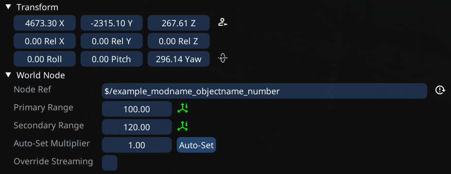
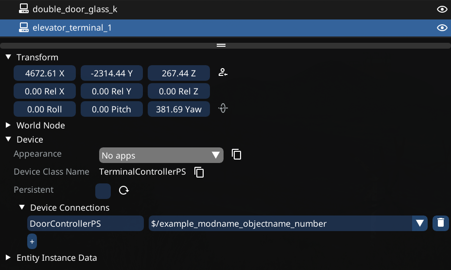
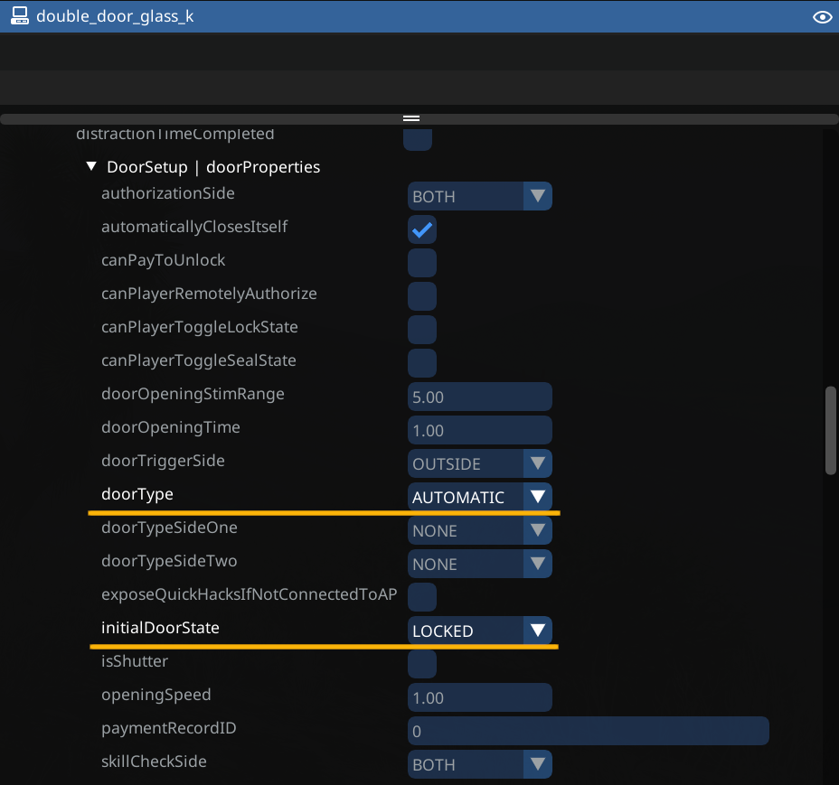
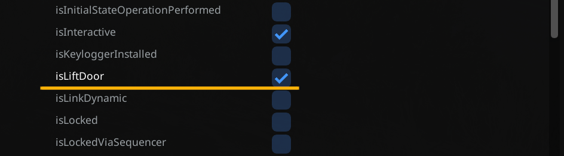

# Custom Elevator Doors

## Custom Elevator Doors

### Requirements

#### Tools

* [World Builder](https://github.com/justarandomguyintheinternet/CP77_entSpawner/releases)

#### Knowledge

* You need to have a basic understanding of:
  * Using World Builder (Spawning things and [importing](https://wiki.redmodding.org/cyberpunk-2077-modding/modding-guides/world-editing/object-spawner/exporting-from-object-spawner) into WolvenKit)
  * How to build [Custom Elevators](https://wiki.redmodding.org/cyberpunk-2077-modding/modding-guides/world-editing/devices/custom-elevators)

#### Overview

* In this guide, we will build a custom door that opens/closes automatically when your lift arrives, but stays locked when the lift is not at the current floor

#### Setup

* You should already have spawned and linked a custom lift, terminals, and markers - as detailed in the [Custom Elevators guide](https://wiki.redmodding.org/cyberpunk-2077-modding/modding-guides/world-editing/devices/custom-elevators)

### Spawning Devices

* First we need to choose a door. For this example we will use a double glass door
* The door we will use is `base\gameplay\devices\doors\double_door\double_door_glass_k.ent`
  * Spawn it as `Device`, and place it somewhere


Make sure to spawn the door as a Device. (Entity -> Device in World Builder)


### Assigning NodeRef

* In order to link and reference the spawned door, it will need it's own unique NodeRef
* Select the door in World Builder, then expand the World Node header and fill the NodeRef field with a unique string

<figure><figcaption></figcaption></figure>


Do not use the same NodeRef name as used in this guide, choose your own unique one instead


### Linking Devices

* Next we need to tell the elevator terminal to use your new door.&#x20;
* First select the terminal for the floor at which you just placed your door
* Go to the Device -> Device Connections header of the terminal
* Add one entry for the new door
  * Fill the device class name field (On the left) with the device class name of the door
    * In our case this would be `DoorControllerPS`, which can also be found under the device header of the door
  * Fill the NodeRef field with the NodeRef of the door that you are linking

<figure><figcaption></figcaption></figure>

### Setting Up Instance Data

* In order for the door to open/close automatically, stay locked when not in use, and be recognized as a lift door, we will need to use entity instance data
* Select the door in world builder and navigate to:
  * `Entity Instance Data / DoorController / persistentState / DoorSetup`
  * under `doorType` select `automatic`
  * under `initialDoorState` select `locked`
  * select `isLiftDoor`

<figure><figcaption></figcaption></figure>

<figure><figcaption></figcaption></figure>


once the automatic setting is selected, the door will no longer function until you import to WolvenKit


### Finishing up

* You should now have an automatic door spawned as a device, with it's own NodeRef, and linked to the terminal of your choosing
* Add this to your custom elevator project in World Builder and you are ready to [export](https://wiki.redmodding.org/cyberpunk-2077-modding/modding-guides/world-editing/object-spawner/exporting-from-object-spawner)
* [Import into WKit](https://wiki.redmodding.org/cyberpunk-2077-modding/modding-guides/world-editing/object-spawner/exporting-from-object-spawner)


This process can be repeated for each terminal in your elevator build



It is possible to link multiple doors to a single terminal. Simply add another entry in Device Connections of the terminal. Especially useful if your lift opens on multiple sides

