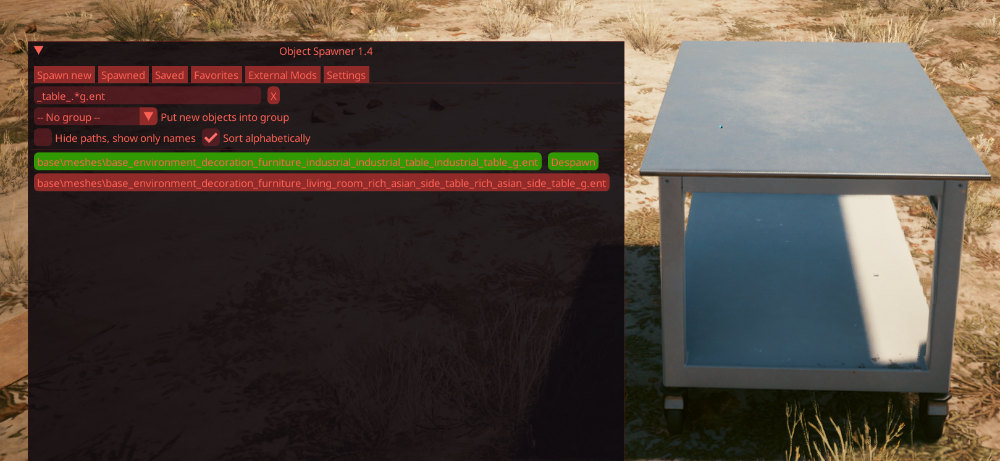
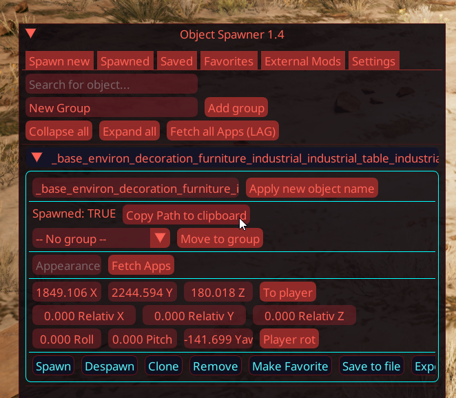
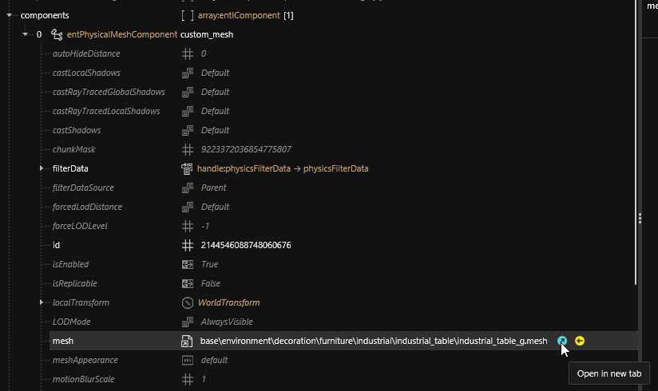
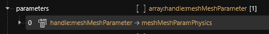
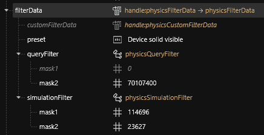
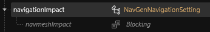
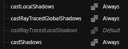
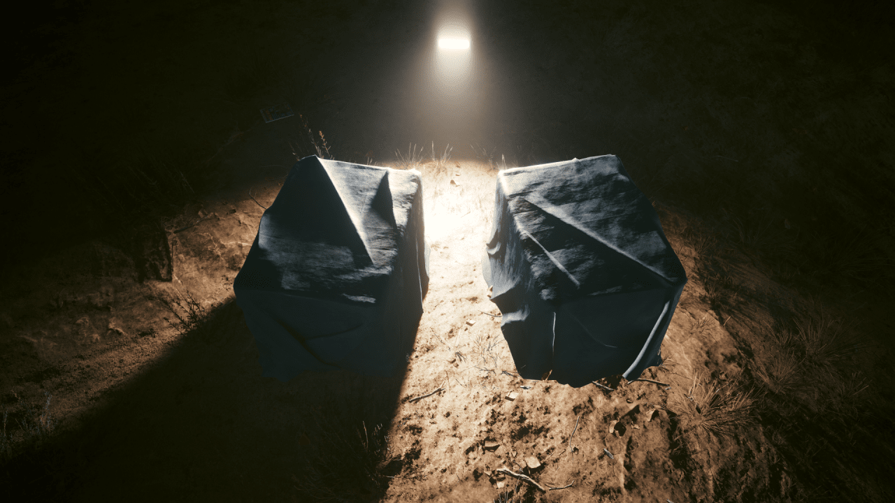
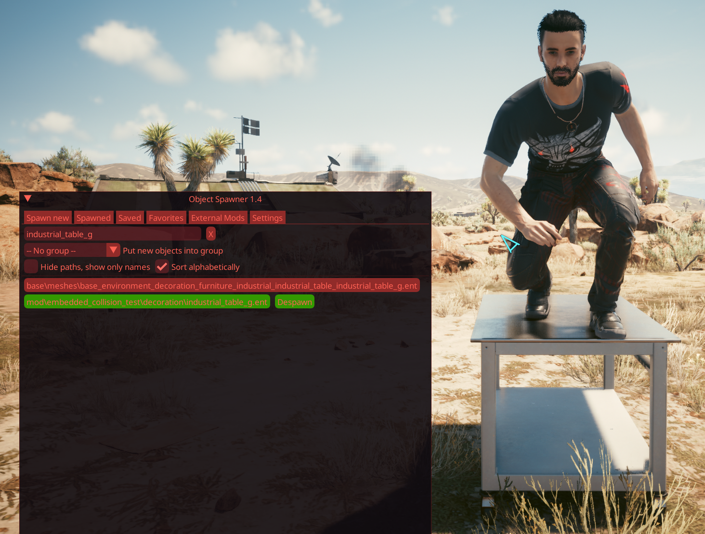

# Enable embedded collisions

## Summary

**Published: January 20, 2024 by** [Akiway](https://app.gitbook.com/u/2021vbDrMKZ0TbHeIx2wzPyAYtl2 "mention")\
**Last documented update: January 25, 2024 by** [Akiway](https://app.gitbook.com/u/2021vbDrMKZ0TbHeIx2wzPyAYtl2 "mention")

This guide shows you how to enable an object's **embedded collision** for entities without (items that you can walk through).&#x20;

It's a direct follow-up to [**Adding Objects to the World**](../archived-guides/adding-locations-and-structures-with-archivexl.md).


As of today (Jan 20 2024), you need a collision-enabled mesh for this. We can create our own collisions with the [wolvenkit-blender-io-suite](../../../for-mod-creators-theory/modding-tools/wolvenkit-blender-io-suite/ "mention"), but the tutorial for this isn't ready yet.


### Wait, this is not what I want!

* If you want to create [custom-props](../../../for-mod-creators-theory/3d-modelling/custom-props/ "mention") for AMM, check the corresponding guide. Note that this mechanism applies for them as well!

## Requirements

* [**Wolvenkit 8.12.0+**](https://github.com/WolvenKit/WolvenKit)
* [**Object Spawner 1.5**](https://www.nexusmods.com/cyberpunk2077/mods/2833) _(screenshots say 1.4, but it's the mod title that wasn't updated in 1.5_ :smile:_)_
* You know how to [adding-locations-and-structures-with-archivexl.md](../archived-guides/adding-locations-and-structures-with-archivexl.md "mention")
* [allmeshes.archive](https://mega.nz/file/eRREwQbY#L7AWM1eYijyvE7GLo6IK4MQE2ohJci9r9xcq5gk8BXQ) and updated [allpaths ](https://mega.nz/file/WEQxySrS#0QM1rbl1QaUuRdU3RcNEVvYk-rfk_mVVDyg75y8XG40)file created by KeanuWheeze - this will help us to edit new ent files with embedded collisions.
* You need a [Wolvenkit Project](https://app.gitbook.com/s/-MP_ozZVx2gRZUPXkd4r/wolvenkit-app/usage/wolvenkit-projects)

## Find an eligible object

Not every object contains an embedded collision, so we first need to check if your desired mesh has one.&#x20;

* Once in-game, search for the item you want to spawn; I'll be using `base\meshes\base_environment_decoration_furniture_industrial_industrial_table_industrial_table_g.ent`

<figure><figcaption></figcaption></figure>

* In the `Spawned` menu, click on `Copy Path to clipboard` to get the current `.ent` path.

<figure><figcaption></figcaption></figure>

* Back in WolvenKit, create or open [your project](https://app.gitbook.com/s/-MP_ozZVx2gRZUPXkd4r/wolvenkit-app/usage/wolvenkit-projects)
* Open the [_Asset Browser_](https://app.gitbook.com/s/-MP_ozZVx2gRZUPXkd4r/wolvenkit-app/editor/asset-browser), turn on the [_Mod Browser_](https://app.gitbook.com/s/-MP_ozZVx2gRZUPXkd4r/wolvenkit-app/editor/asset-browser#mod-browser) option, paste the path and add the ent to your project.

<figure><figcaption></figcaption></figure>


After you added it, **turn off the Mod Browser option**; otherwise, you won't be able to get the mesh file in the next step.


* Open the [.ent file](../../../for-mod-creators-theory/files-and-what-they-do/file-formats/entity-.ent-files/#mesh-component-entity-simple-entity) and look for the mesh component in its components array.
  * If the selected entity is from **allmeshes** (starts with `base\meshes\` ), then there is probably only 1 <mark style="color:orange;">entPhysicalMeshComponent</mark> called _custom\_mesh_
  * If not, it means your entity is from the vanilla game; in this case, search for the component that has Mesh in its type (<mark style="color:orange;">entPhysicalMeshComponent</mark>, <mark style="color:orange;">entMeshComponent</mark>, etc...)
* In the mesh, click on the blue arrow to open the mesh in a new tab (_we don't need to add the file_)

<figure><figcaption></figcaption></figure>

* Decisive moment: Open parameters and look for a <mark style="color:orange;">meshMeshParamPhysics</mark>

<figure><figcaption></figcaption></figure>

Have you found it ? Amazing ! It means the mesh has a native collision that we can toggle on. :thumbsup: [Let's do this now.](enable-embedded-collisions.md#activate-the-mesh-collision)


**What if there is no&#x20;**<mark style="color:orange;">**meshMeshParamPhysics**</mark>**&#x20;parameter in the mesh ?**

It means that there is no collision with it. But other solutions exist for you:

* You can create your own collision through Blender (no modding ressource is available at this time)
* You can fake the collision by using another small entity which already has collision embedded, and hide the small entity inside your item (this technique is a work-around, that does not always fit or give satisfaction, but most of the time it does the job)
* You can try to find another similar item that has embedded collisions (and go back to the first step of this page)


## Activate mesh collisions

Turning it on is pretty simple; we only have 2 things to change, all in the .ent file previously added:

* Update the `filterData` and change the values like in the screenshot. Those values determine which entities can collide with, and how to simulate the collision.&#x20;

<figure><figcaption></figcaption></figure>


This information is not well-researched as of Jan 2024 - if you know anything more about this, please get in touch via [Discord](http://discord.gg/redmodding) or update the wiki!


* Change the `navigationImpact` setting to `Blocking`. (Other values exist; they haven't been documented, but you may have fun with them.)

<figure><figcaption></figcaption></figure>

* **Optional**_:_ depending on the item, you may want to enable (or not) lighting-based shadows. You can do so by setting these 3 properties to `Always`.&#x20;

<figure><figcaption></figcaption></figure>

Lighting-based shadows comparison

Here is the difference between the values `Always` and `Never`

**Note:** As you can see, `Never` values will prevent the mesh from casting shadows in the surrounding environment, but your mesh will still handle local shadows cast on itself.


I strongly suggest you to change the .ent name and folder to [a custom one](../../items-equipment/moving-and-renaming-in-existing-projects.md), so it doesn't interfere with the rest of the game.


In our test case, I renamed the file as `mod\embedded_collision_test\decoration\industrial_table_g.ent`.

* If the path of your ent changed, don't forget to add it to the allPaths.txt file used by Object Spawner.

That's it! All you have to do now is to [install your mod and launch the game](https://app.gitbook.com/s/-MP_ozZVx2gRZUPXkd4r/wolvenkit-app/menu/toolbar#install-and-launch).&#x20;

Once in-game, open and load the new entity with the new path and verify that collision is enabled. :tada:

<figure><figcaption></figcaption></figure>
