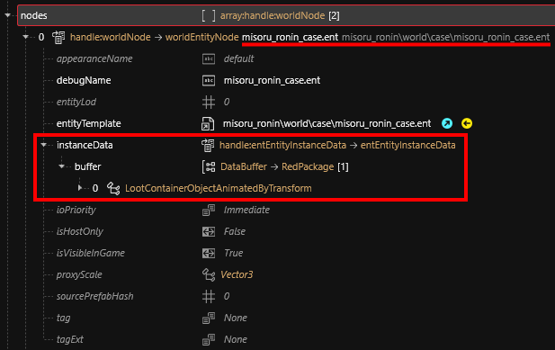
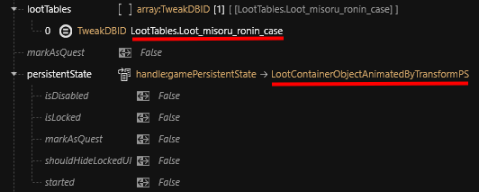

# Lootable world objects

## Summary

Created by Misoru

This guide will teach you how to turn a world object into a lootable container.

## Requirements

* [Latest version of Wolvenkit](https://wiki.redmodding.org/wolvenkit/getting-started/download)
* Working .streamingsector with the object you want to make lootable (if you haven't done this yet, [follow this guide](https://wiki.redmodding.org/cyberpunk-2077-modding/modding-guides/world-editing/adding-objects-to-the-world))

## **Step 1: Create your loot table**

Before making your object lootable, we first need to create the `lootTable` that we'll later reference in our `.streamingsector`, and add it to our Tweak `.yaml`. Below is an example:


Search "LootTables" in Tweak Browser for more examples and methods.



```yaml
LootTables.Loot_misoru_ronin_case: # Loot table identifier
  $type: gamedataLootTable_Record
  lootGenerationType: dropChance
  lootItems:
  - $type: gamedataLootItem_Record # Append a separate entry for each item you want added to your container
    dropChance: 1 # Value from 0 to 1 determining % drop chance
    dropCountMax: 1 # Max quantiy of this item
    dropCountMin: 1 # Min quantity of this item
    itemID: Items.Preset_Satara_Ronin # The item added to your loot table
  maxItemsToLoot: 1 # If more than 1 lootItems, change this number accordingly
  minItemsToLoot: 1 # ditto
```


## **Step 2: Verify your object's components**

Open the `.ent` for the object you want to make lootable and verify its `components` include entries like `gameInventory`, `gameinteractionsComponent`, and `GameplayRoleComponent`. These `components` are all commonly included in `.ent` files for base game containers and [may be a requirement.](#user-content-fn-1)[^1]

<figure><figcaption><p>Example (<code>weapon_case_medium.ent</code>)</p></figcaption></figure>

## **Step 3: Identify your object in your .streamingsector**

Open the `.streamingsector` containing your object and find its `nodes` entry.&#x20;


If you're having difficulty determining which `nodes` entry corresponds to the object you want to make lootable, use [World Inspector](https://wiki.redmodding.org/cyberpunk-2077-modding/for-mod-creators-theory/modding-tools/redhottools/rht-the-world-inspector) to identify.


Under `instanceData`, create handles for `LootContainerObjectAnimatedByTransform`, then add the `lootTable` we created in Step 1 and define the `persistentState` to `LootContainerObjectAnimatedByTransformPS`. Leave everything else default.

<figure><figcaption><p>Example <code>.streamingsector</code></p></figcaption></figure>


Notice that `lootTables` is an array, so you can add multiple `lootTables` if needed!


<figure><figcaption><p>Example <code>lootTable</code> and <code>persistentState</code> </p></figcaption></figure>

## You're done!

Your object should now be a lootable container. Load up your mod and test it out. If it's not working, verify you defined your `lootTable` correctly (or use a base game `lootTable` for testing) and edited the correct `.streamingsector` `nodes`.

[^1]: Though I haven't done extensive testing, so let me know if your container works without these!
