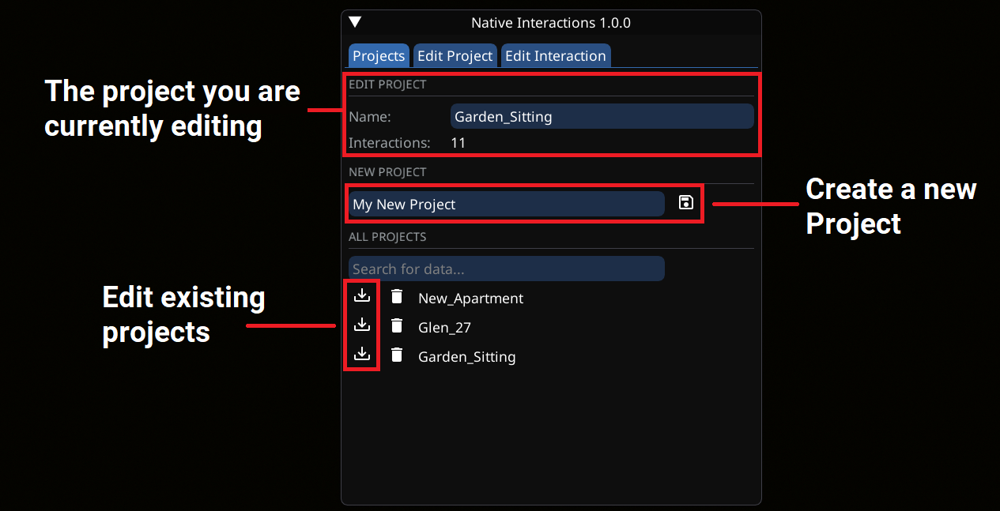
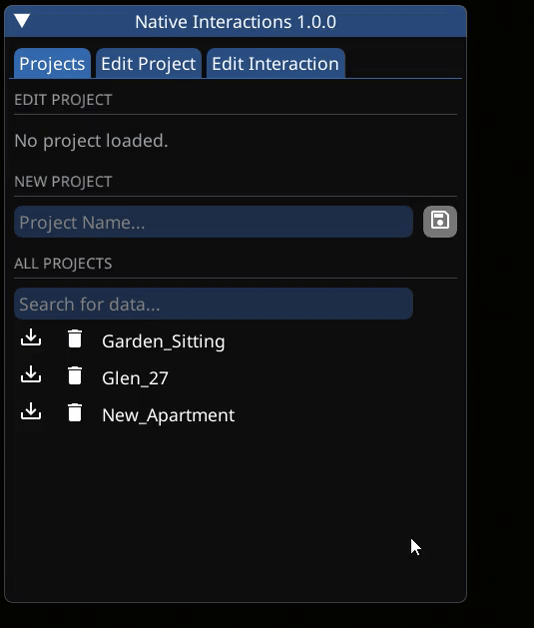

# Getting Started

## Creating Project

* All interactions are organized intro projects, you usually have one project per mod
* To create a new project, go to the `Projects` tab
* Enter a name, then hit the save icon to create and load a new project

<figure><figcaption>
Creating, managing and editing existing projects
</figcaption></figure>


In this guide, "loading" a project means loading it to edit, as any project installed will be active by default


## Adding Interactions

* To add an interaction, make sure you have loaded a project by pressing the "Load" icon to the left of it's name in the `Projects` tab
* Switch to the `Edit Project` Tab
* Now select the type of interaction from the dropdown, add a name, and hit the plus icon to add it
  * New interactions will be placed at the player's feet

<figure><figcaption>
Add a new interaction
</figcaption></figure>

## Edit Interactions

* Information on how to edit an interaction and what it's properties do, can be found here:
  * [Interaction Settings](interaction-settings.md)

## Sharing Creations

* For each project, an equally named `.json` file is created in the mod's folder:
* `Cyberpunk 2077\bin\x64\plugins\cyber_engine_tweaks\mods\nativeInteractions\projects\projectName.json`
* To publish your mod, simply include the project's JSON file, and add NIF as requirement


Project files for sharing can be found in

`Cyberpunk 2077\bin\x64\plugins\cyber_engine_tweaks\mods\nativeInteractions\projects`

