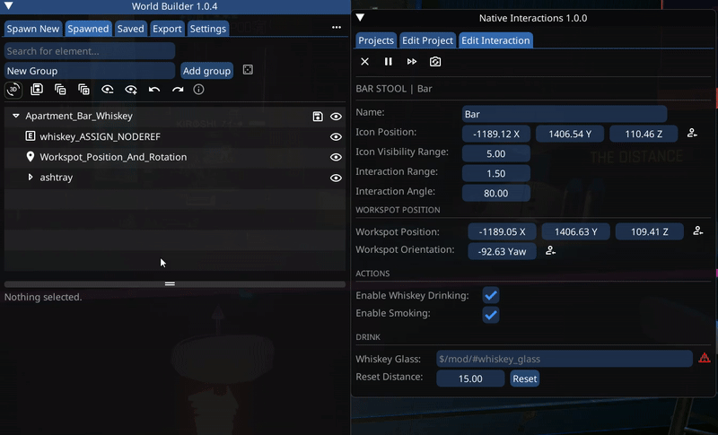
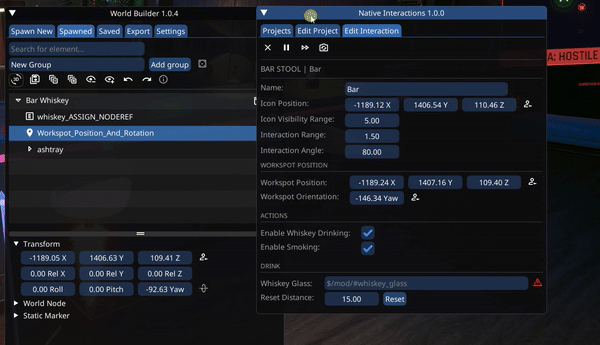

# Interactions with Props


These interactions have props / in-world objects as part of their animations

This means you will have to place the props, and tell the interaction to use them


## How to place props

* For placing the props, you will need to use [World Builder](../object-spawner/)
  * If you have not already, [install World Builder](../object-spawner/installation.md), and get familiar with the [basics of using it](../object-spawner/quick-start.md)
  * You also need to know how to [export your WB build to a native world edit](../object-spawner/exporting-from-object-spawner.md#exporting)
* Aligning the props with the interaction's animations can be tricky, to make the process easier NIF comes with a World Builder favorites group containing ready to place alignment helpers
  * These also contain the correct props for the interactions

## World Builder Placement Prefabs

* For each interaction which uses props as part of an animation, there is a World Builder Prefab
* Start by navigating to the [Favorites](../object-spawner/ui-tabs-explained/tab-favorites-and-prefabs.md) section in WB (`Spawn New -> Favorites`)
* Next, expand the `Native Interactions` category header
* Here you can find all the placement helpers
* Spawn the one you want, either by clicking or drag and dropping it


When moving the placement helper, make sure to always move the entire group, not individual elements within it. This is to make sure that they all stay positioned the same relative to each other.


* Now you can move the newly spawned group into position

<figure><figcaption>
Spawning and moving a placement and prop helper prefab in WB
</figcaption></figure>

### Assigning NodeRefs


NodeRefs are **unique** strings used by the game to reference a Node, or in our case a prop for an interaction


* For each element in the placement group, which says `ASSIGN_NODEREF`, do the following:
  * Select it
  * Expand the `World Node` header
  * Assign a unique NodeRef (You can use the auto-generate button)


Nodes / Props will only be able to be resolved from their NodeRef (And usable for the interaction) once the group has been converted to a native world edit


<figure><figcaption>
Assigning (And copying) NodeRefs. Keep in mind that the warning in NIF will only go away once the group in WB has been converted to a native world edit
</figcaption></figure>

* Once you have assigned the NodeRefs, go ahead and [convert the group to a native world edit](../object-spawner/exporting-from-object-spawner.md#exporting)
* After a quick game restart, you can now copy the NodeRefs over to NIF, and should see the icon to the right become green

### Copying Workspot Position

* To now make sure that the animation will play in the correct position, select the `Workspot_Position_And_Rotation` element
* Copy its position and rotation from under the `Transform` header over to the [Workspot Position controls](interaction-settings.md#workspot-position) in the NIF window

<figure><figcaption>
Copying the Workspot Position and Orientation (Yaw) from the WB helper over to the interaction settings
</figcaption></figure>

## Recap

* You should now have:
  * Spawned and positioned (As a whole group) an alignment prefab in WB
  * Assigned unique NodeRefs to all the props
  * Copied the NodeRefs over to NIF
  * Copied the position and orientation from the WB helper marker element over to NIF
  * Converted the WB group to a native world edit
* For interactions which use props, but not as part of an animation (Thus their position is irrelevant), you can simply spawn them where ever you want with WB, assign a NodeRef, convert to native edit, and link
  * E.g. The TV for the sit and TV control interaction)

