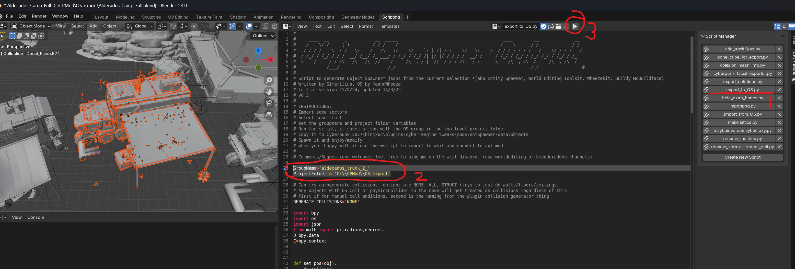
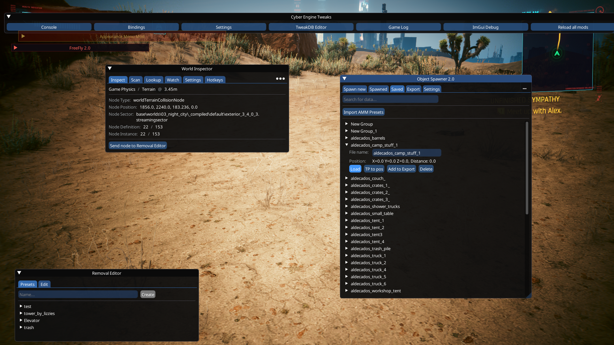

# Creating Prefabs with Blender


The script described below is a WIP, and only supports about half the node types Wheeze has implemented (I cant keep up) if in doubt, use the latest plugin artifact, and if somethings missing you need, bug me on discord about it.


## Summary

Created: Mar 15 2025 by  [Simarilius](https://app.gitbook.com/u/G2MqNkfgTlQ1R3G4B5s6WefLjdy2 "mention")

## Optimisation is a way of life

I'm too lazy to always build every thing from scratch, so I like to optimise my workflow by spending loads of time writing a script to do stuff later. Lucky for you I share them so you get to be optimised too.

Theres a script included with the Blender addon that lets us export the current selection from an imported sector to an OS group json. This can then be turned into a prefab which you can reuse and share. No more hunting for bed + pillows + duvet etc. Just find one you like in game, use RHT to get the sector names, import them to blender and ~~steal~~  borrow it, complete with all the little extras that make it feel polished.

## Find some sectors

The first step is to export the location of your inspiration to blender, as explained in the [Editing Locations in Blender](../../miscellaneous/editing-locations-in-blender.md) guide. I use RHT to scan the location and then use the copy sectors button to just take a list of every sector in the immediate vicinity. add ot project, run the sector export script and import the project to Blender, and we're good to go.&#x20;

### Like Stealing Candy from a baby

And unlike Mr Burns, we're not going to struggle. Select some stuff, switch to the scripting tab. In the empty text window, click the little arrow to the right to expand out the side panel.

<figure><figcaption><p>Switch to scripting, then click the tiny arrow to expand the panel</p></figcaption></figure>

in the CP77 Modding tab theres a list of scripts, click the export\_to\_OS.py one (1 below). This will open in the text window. At the top of the script, theres a variable for the folder to save to, and the groupname (2). Set the folder, and define a group name. Currently it writes over that filename everytime you run it, so change it between selections.

When you've set them, hit the play button. (3)

<figure><figcaption><p>Easy as 1,2,3</p></figcaption></figure>

You should now have a json in the folder you specified, this needs copying to the EntSpawner objects folder, which can be found at&#x20;

```
Cyberpunk 2077\bin\x64\plugins\cyber_engine_tweaks\mods\entSpawner\data\objects
```

## Pure Favoritism

Load the game up, bring up your CET console etc and in the object spawner window, switch to the saved tab. Your jsons should be in the list, and if you click on one you can hit load.

At this point OS loads them at the position they were defined at, which is wherever we borrowed them from.&#x20;

<figure><figcaption><p>Loads of borrowed groups</p></figcaption></figure>

I always move them to my location to test them and check nothings gone wrong, as its all too easy to either miss something you intended to include, or include something you didnt want. to do this switch to the spawned tab, select the top level group and in the transform bit below the group, hit the person button to bring it to your location.&#x20;

If your happy with it, right click the group, and select Make Prefab

<figure><figcaption><p>Bring the group to your location, and if its ok, convert to prefab</p></figcaption></figure>

This pops up a dialog that lets you select tags and put it in a Category.  You can just select any existing tags, or create new ones from the dialog. Hit the little tick at the bottom of the dialog to ok it.

<figure><figcaption><p>Assign tags and categories, then hit the tick in the circle at the bottom.</p></figcaption></figure>

Switch to the Spawn new tab, and your new prefab should be in the list under the category you selected. you can filter the list by the tags too.

<figure><figcaption></figcaption></figure>

