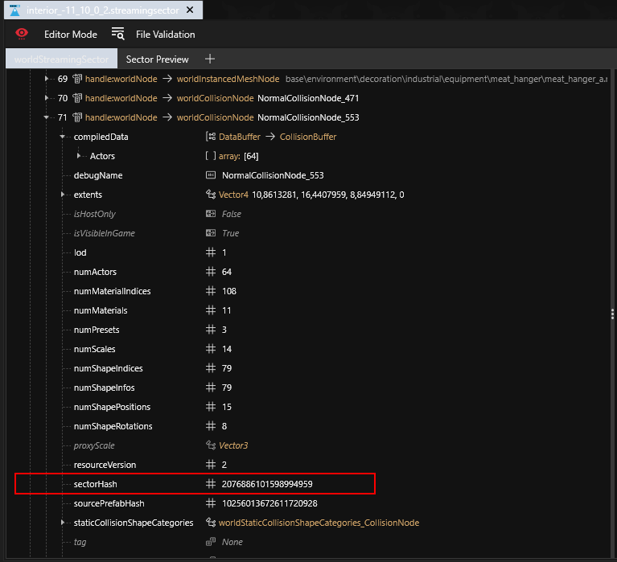
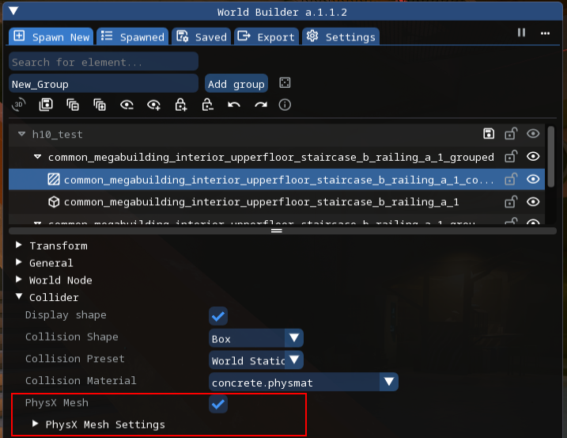
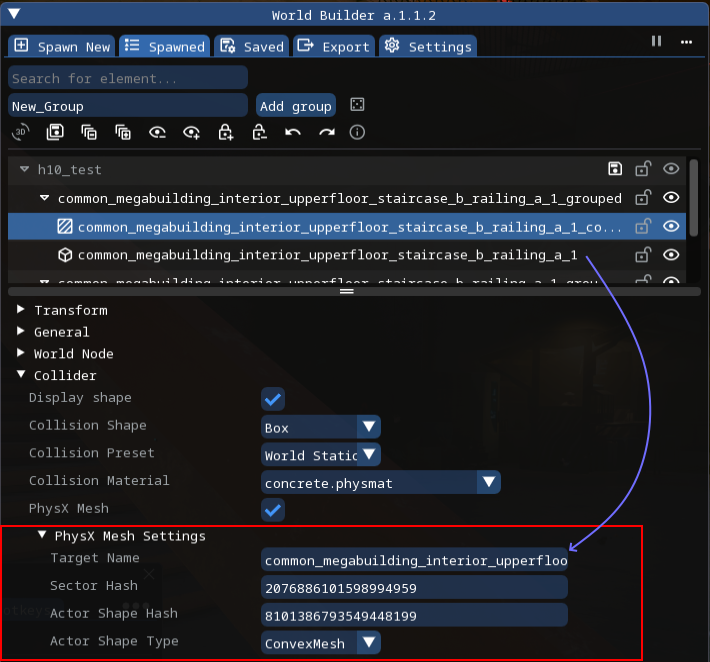

# Geometry-cache meshes for streaming-sector collision nodes

## Requirements

* [WolvenKit](https://github.com/WolvenKit/WolvenKit)
* [RedHotTools](https://github.com/psiberx/cp2077-red-hot-tools)
* [World Builder](https://github.com/Oxion/cyberpunk2077_entSpawner) (with geometry-cache meshes for streaming-sector collision nodes, available in linked fork as of now)

### Knowledge

* Basic understanding of:
  * How to work with WolvenKit, RedHotTools and World Builder
  * Data structures which are used in game world implementation, like [.streamingsector](https://wiki.redmodding.org/cyberpunk-2077-modding/for-mod-creators-theory/files-and-what-they-do/file-formats/the-whole-world-.streamingsector)

### Step 1: Resolve PhysX mesh identifiers in the geometry cache



#### Enable **Game Physics** targeting mode in RedHotTools World Inspector.

<figure><figcaption></figcaption></figure>



#### Target the desired object in-game.&#x20;

In World Inspector, note the **streaming-sector file name** and the **node definition index** within that sector.

<figure><figcaption></figcaption></figure>



#### Find and open the streaming-sector file in WolvenKit.

<figure><figcaption></figcaption></figure>



#### Find the node whose index matches step 1.2.

<figure><figcaption></figcaption></figure>



#### Locate the `sectorHash` field on that node.&#x20;

You will enter this value into the World Builder collider Sector Hash parameter.

<figure><figcaption></figcaption></figure>



#### Open the sector preview tab in WolvenKit&#x20;

find the node with the index from **step 1.2** in the nodes tree.

<figure><figcaption></figcaption></figure>



#### Search for exact collider which represents object

Use the visibility toggle to find the tree entry (and its index in the name) for the actor that represents the collision of the targeted object.

<figure><figcaption></figcaption></figure>



#### Return to the sector data tab.&#x20;

Under `compiledData` → `Actors`, open the actor whose index matches step 1.7. Expand Shapes, then the first item. The fields you need are `Hash` and `ShapeType`; use them for the World Builder collider parameters.

<figure><figcaption></figcaption></figure>



### Step 2: Create the collider in World Builder



#### Spawn the desired mesh object and add a simple collider for it.


**Important:** the mesh object and the collider must be in the same group at the same hierarchy level.


<figure><figcaption></figcaption></figure>



#### Enabling PhysX mesh for collider

Select the collider, enable **`PhysX Mesh`** (the `PhysX Mesh Settings` section appears), and expand it.


With PhysX Mesh enabled, the simple collider shown in-game is only for editing; it is not exported. The PhysX mesh is what gets exported.


<figure><figcaption></figcaption></figure>



### Set the PhysX mesh parameters

* **Target name:** name of the object you are attaching the collider to
* **Sector hash:** value of the `sectorHash` field from step 1.5
* **Actor Shape Hash:** value of the `Hash` field from step 1.8
* **Actor Shape Type:** value of the `ShapeType` field from step 1.8

<figure><figcaption></figcaption></figure>


