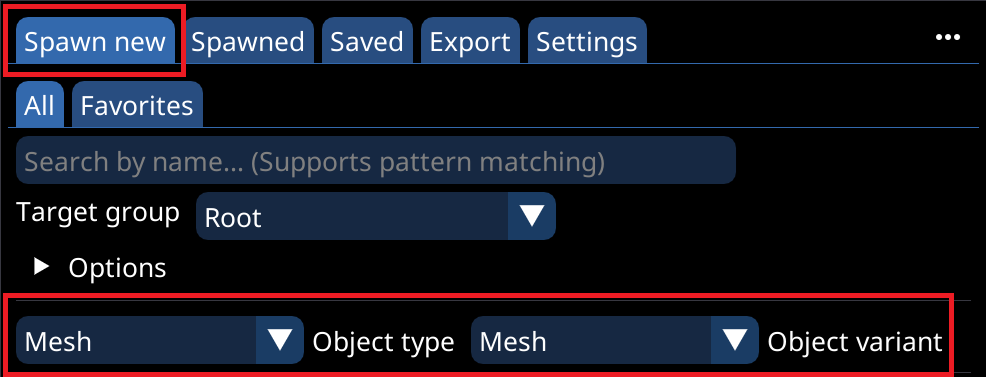
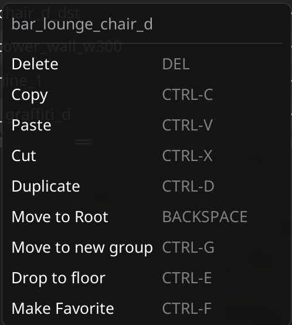
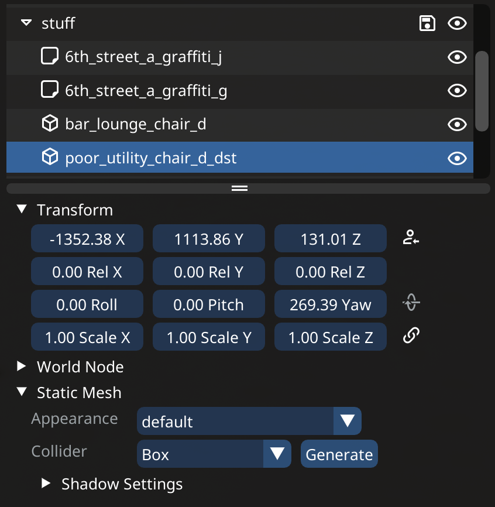

# Quick Start


This example leaves out a lot of features and details


## About this guide

* This guide requires that you have [installed OS](installation.md)
* It will try and explain how to do a very simple build, incorporating the basics you need to know
* It assumes you know how to open the CET overlay and find the main "Object Spawner" window

## Spawning things

* Lets start by spawning some things, we will start with some meshes
  * To do so, switch to the "Spawn New" tab, and select the `Mesh` object type and the `Mesh` object variant

<figure><figcaption>
Here you can select what to spawn, filter, preview, drag and drop to your heart's content This is also where you can find your <a href="ui-tabs-explained/tab-favorites-and-prefabs.md">favorites and prefabs</a> tab
</figcaption></figure>

* Some tips:
  * Take a look at the different "Object type" options, and explore the "Object variants" of each type, there is everything from [decals to reflection probes](supported-nodes.md)
  * Separate the "Spawn New" tab, by clicking the `...` in the upper right corner
  * Check out the options header
* If you have found what you wish to spawn, simply click it's list entry
  * Tip: You can also drag and drop the list entry directly onto the position in the world where you want it to spawn

## Organizing spawned things

* Lets quickly take a look at how to organize the things you have spawned, and save them, before it gets too messy
* All the editing is done via the "Spawned" tab, so switch there (Hence why i recommend separating the "Spawn New" tab)


Hover the `I` icon in the top toolbar, to get a list of all hotkeys available


<figure><figcaption>
Add group, drag and drop, range select, and finally CTRL-G hotkey
</figcaption></figure>


In order to save what you have built, it needs to be inside a group


* Make a new group by hitting the "Add group" button
* Rename the group by double-clicking its entry (This works for everything)
* Now lets move what you have spawned so far into the group:
  * You can either drag and drop each element on its own into the group
  * You can also use range select (Hold shift while clicking the first and last element), then drag and drop all the selected elements at once
  * You can also first select everything (`CTRL-A` ), then use `CTRL-G` to put everything selected into a new group


Use groups inside groups to further organize your build


* Now, hit the save icon of the group (Or `CTRL-S` to save all groups), to save your build
* You can also bring up a context menu by right-clicking an element:

<figure><figcaption>
Tip: Bring up the context window of a group, then select "Set as "Spawn new" group"
</figcaption></figure>

## Moving things

* All the controls for changing object's properties can be found by selecting the object, this will show it's controls in the bottom part

<figure><figcaption>
Selecting an object (This also works for groups), shows it's properties at the bottom
</figcaption></figure>


You can drag the vertical divider bar to change the ratio of tree view (Top) to properties (Bottom)


* In order to move the selected object (Or group), simply drag the controls under the "Transform" header
  * While hovering the controls, the corresponding axis arrow of the object will be highlighted
* Explore all the control options you have for each type of object

## What comes next

* [Exporting you build](exporting-from-object-spawner.md#exporting), in order to turn it into a native world edit
* Reading up on (Or exploring yourself), [all the features of each tab](ui-tabs-explained/)
* Using the [3-D Editor Mode](3-d-editor-mode.md)
* Creating [favorites](ui-tabs-explained/tab-favorites-and-prefabs.md)
