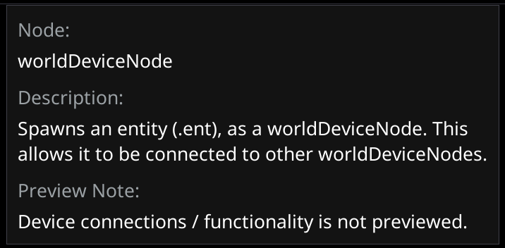
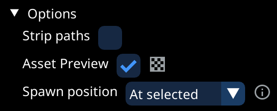
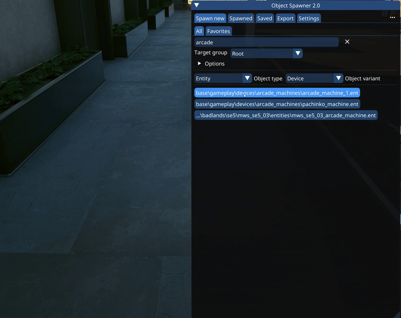
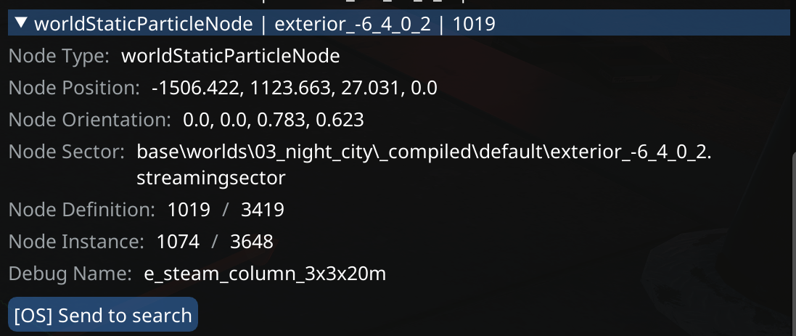
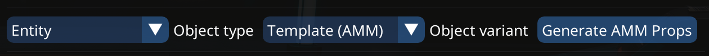

# Tab: Spawn New

## Selecting Object Type

* There is a [wide range of things](../supported-nodes.md) you can spawn, so they are organized into categories
* Each category has has multiple variants, with each variant corresponding to a type of node

<figure><figcaption>
Check out all the different types and variants
</figcaption></figure>

* By hovering over the dropdown for the Object variant you can also bring up a panel displaying some helpful information for the selected variant

<figure><figcaption>
Information panel shown when hovering type selector
</figcaption></figure>

## Spawn Options

* Target group
  * This selector lets you choose a group which to put new objects into
  * You can also hit `CTRL-N` on the spawned tab to set it to the selected group
* Under the options header you can find:
  * Strip Paths: If this is enabled, resource paths will be shortened: `base\object.mesh` becomes `object`
  * Asset preview: Lets you toggle asset preview for the supported object types
  * Spawn position: See next section

<figure><figcaption>
Spawn options
</figcaption></figure>

## Spawn position options

* There are multiple ways of controlling the position in which new objects spawn:
* Use the "Spawn position" selector to determine the position used when simply clicking a list entry to spawn
* Drag and drop a list entry into the scene to spawn it under the cursor
* In 3-D editor mode, use `CTRL-R` to repeat the last spawn under the cursor
  * Additionally, you can use the `Shift-A` spawn menu while editor mode is active

<figure><figcaption>
Drag and drop directly into the scene
</figcaption></figure>

## Asset Preview

* Asset preview is available for:
  * With background: Meshes, entities, decals
  * In-Place: Effects, particles, AISpots and sounds
* It gets activated simply by hovering a list entry

<figure><figcaption>
Asset preview with background
</figcaption></figure>

## Searching

* At the very top you can find the main search, which supports pattern matching:
  * E.g. `wall.*large` will match anything that has the words "wall" followed by some characters, followed by "large" in it

## Favorites

* You can make something a favorite either from the "Spawned" tab, or from the "Spawn New" tab
* In either cases, simply right-click the element you wish to make a favorite
* [Further information on favorites, prefabs and tags](tab-favorites-and-prefabs.md)

## RHT Integration

* If you see an asset used in the gameworld, you can use [RHT](https://wiki.redmodding.org/cyberpunk-2077-modding/for-mod-creators-theory/modding-tools/redhottools/rht-the-world-inspector) to send it directly to OS's search
* This is supported for: Entity, Entity Record, Device, Mesh, Decal, Particle, Effect, Static Sound, AI Spot and Reflection Probe

<figure><figcaption>
You can send things you find with RHT directly to OS' search
</figcaption></figure>

## AMM Props

* You can also import your list of AMM props
  * AMM props will spawned as [entity nodes](../supported-nodes.md#entity), as they are just `.ent` files with an alias name
* Do this by selecting `Entity -> Template (AMM)` then pressing the "Generate AMM Props" button

<figure><figcaption>
Select the correct type and variant, then you can import your AMM props list
</figcaption></figure>
