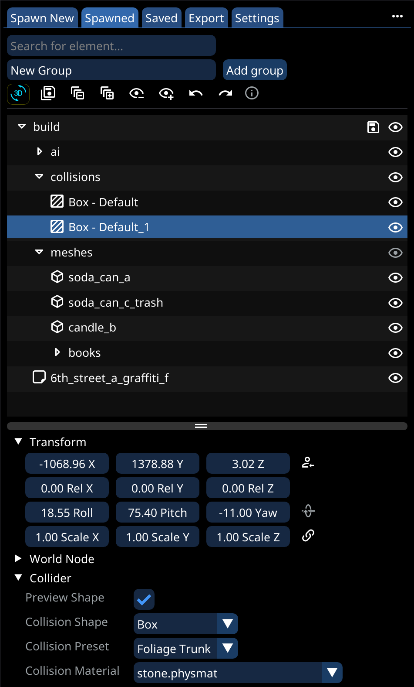
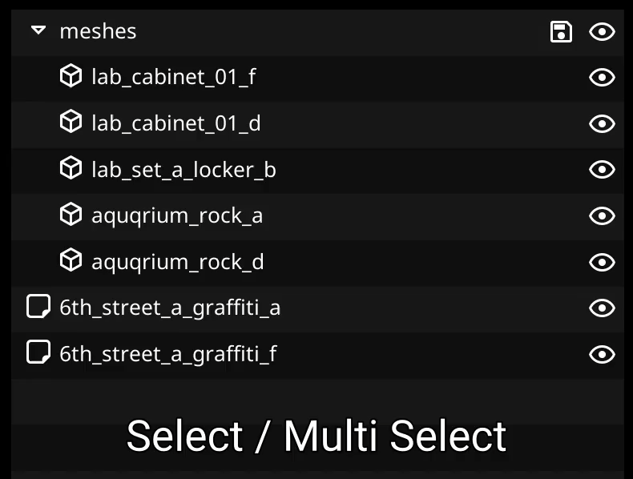
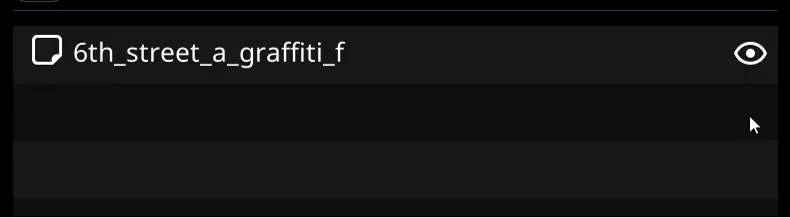
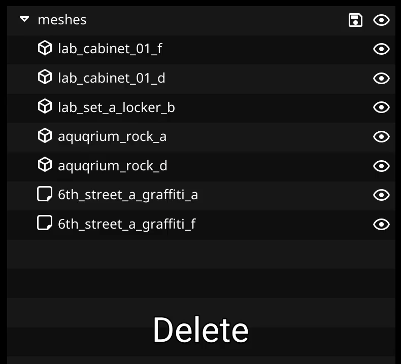
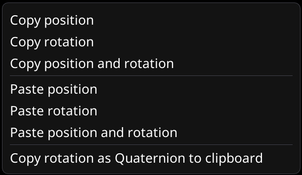
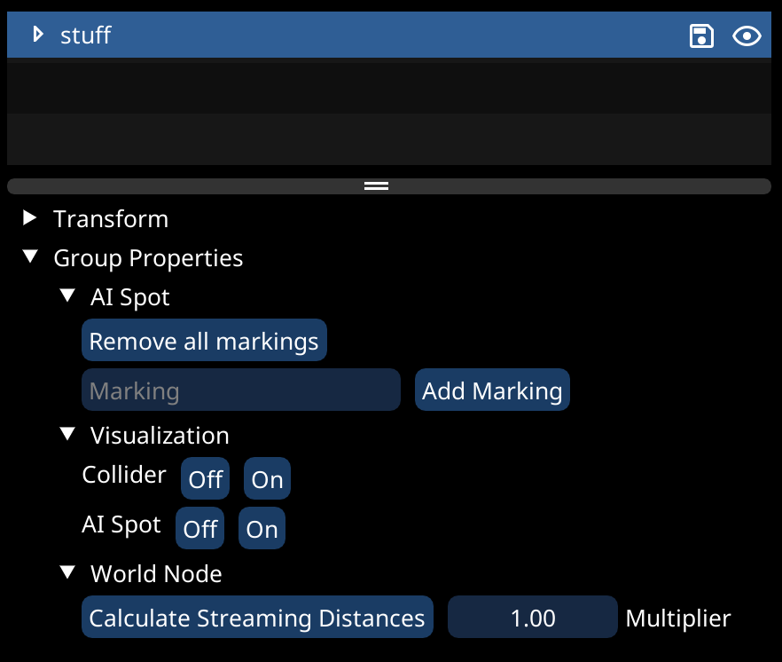

# Tab: Spawned

<figure><figcaption>
The main view where you organize, move, and edit your build Split into top part showing what you have spawned, and a group based sructure, and bottom part showing properties of the selected element(s)
</figcaption></figure>

## Toolbar

* At the top (Underneat the search and add group options), you will find the toolbar:

<figure><figcaption></figcaption></figure>

* From the left to right you have:
  * [3-D Editor mode](../3-d-editor-mode.md) toggle
  * Save All button, saving all loaded root groups
  * Expand and collapse all, expanding / collapsing all groups
  * Hide / Show all, spawning / despawning everything
  * Undo and redo
  * Shortcut info

## Scene view controls

* This is main part from which you organize your build
* It is a tree type hierarchy, similar to the one in e.g. blender, with groups and objects


Hovering the `I` icon gives you a list of all available shortcuts


### Moving and selecting

* These are very similar to the ones found in most file explorers
  * `LMB` : Select
  * `CTRL + LMB` : Make a multi-selection
  * `SHIFT + LMB` : Make a range-selection
  * `CTRL-A` : Select all
  * `Esc` : Unselect all
* To move elements:
  * Drag selected elements onto group element, to move into group
* To reorder elements:
  * While holding down `Shift`, drag selected elements into their new position

<figure><figcaption>
Moving and selecting, drag and drop
</figcaption></figure>

### Changing visibility

* You can change whether or not an object or group is visible by either:
  * Use the little "Eye" icon on the right of a element
  * Press `H`, to toggle visiblity of all selected element

<figure><figcaption>
Change visibility of element
</figcaption></figure>

### Hotkeys

* `Double Click` : Rename double clicked element
* `Delete`: Delete all selected
* `CTRL-C:` : Copy selected
* `CTRL-V` : Paste selected
* `CTRL-X` : Cut selected
* `CTRL-D` : Duplicate selected
* `CTRL-G` : Put all selected into a new group
* `CTRL-S` : Save all root groups
* `CTRL-E` : Drop selected too floor
* `CTRL-N` : Set selected group as "[Spawn New](tab-spawn-new.md)" target group
* `CTRL-F` : Make selected a [favorite / prefab](tab-favorites-and-prefabs.md)
* `Backspace` : Move all selected to root


A "root group" is just a group which is not inside another group, thus you can save it

If you want to save a sub-group, to make it reusable, [make it a prefab](tab-favorites-and-prefabs.md#creating-favorites-prefabs)


<figure><figcaption>
Use the main hotkeys to copy, paste, cut, duplicate, delete, rename and re-group
</figcaption></figure>

### Context menu

* Additionally you can bring up a context menu for the current selection, by right-clicking

<figure><figcaption>
Right-Click Context menu for a single element
</figcaption></figure>

## Transform controls

* Use the controls under the "Transform" header to move and rotate your current selection
  * You can move single objects, but also groups and multi-selections

<figure><figcaption>
Example of changing transforms of a single object and a group / multi selection
</figcaption></figure>

* You can also copy transforms from one object to the other, using the transforms context menu
  * You can open it by right-clicking any of the transform controls

<figure><figcaption>
Copy and paste transforms between objects
</figcaption></figure>


Enable precision mode by holding down shift while using the transform controls


## Group properties

* When having multiple elements selected (Or a group), you can use the "Group Properties" header to control certain properties of all elements of a type
  * E.g. Visibility of all colliders inside the selection

<figure><figcaption>
Example of some group properties, especially the "Visualization" options are helpful For more information on the World Node settings, see next section
</figcaption></figure>

## World Node options

* Here you can give each object a NodeRef


A NodeRef is a unique identifier which can be used to reference one specific object (If you do not need it, just leave it empty)


* As already mentioned in the [Exporting to WolvenKit](../exporting-from-object-spawner.md#streaming-ranges) guide, there are multiple values controlling streaming ranges
* The ranges found under the World Node header of each object control when that specifc object streams in / out
* To make setting these easier, there is a "Auto-Set" button
  * As seen in the [Group properties](tab-spawned.md#group-properties) section, you can also auto-generate the values for all your builds objects at once

<figure><figcaption>
World Node properties, which every type of object / node you can spawn has
</figcaption></figure>


Having too large or too small primary/secondary range can lead to bugs

E.g.\
Too large range can cause performance issues and audio bugs\
Too small range for things like markers can lead to issues, if other objects depend on the marker being streamed in

