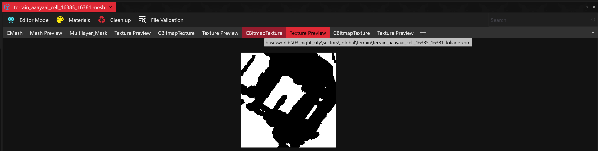
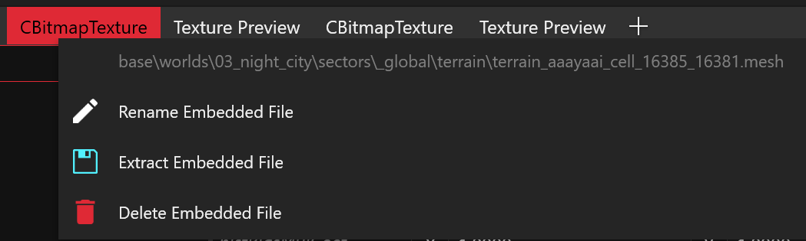
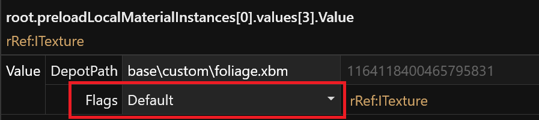

# Removing grass and small foliage

## Requirements

* WolvenKit
* MS Paint
* [RHT](https://github.com/psiberx/cp2077-red-hot-tools)

## Finding the terrain mesh

* First, find the `worldTerrainMeshNode` on which the foliage resides, using RedHotTools
  * To make this easier, go to the settings tab of the World Inspector window, and set "Show Marker" to always
* Copy the mesh path clipboard by middle-mouse-button clicking it

<figure><figcaption>
Locating the right terrain mesh node, made easier by forcing markers to always show
</figcaption></figure>

## Extracting files in WolvenKit

* Now, add the mesh file to your WolvenKit project
* Open the mesh file
*   At the top of the mesh view window, you will see a collection of "CBitMapTexture / Texture Preview" headers

    * Locate the `CBitMapTexture` which when hovered shows the file-name `...foliage.xbm`
    * Right click it, and select "Extract Embedded File", and chose a location to save it too (Default is fine)

    <figure><figcaption>
Find the one which is a BW texture, and the corresponding CBitMap texture one, which is named <code>...foliage.xbm</code>
</figcaption></figure>

    <figure><figcaption>
Right-Click the CBitMapTexture one, and select extract
</figcaption></figure>


This texture is used as a mask, to block foliage spawned at runtime based on various other embedded masks, appearing in certain spots

Try and figure out which part of the texture corresponds to what part of the world


## Finding the right part

* Now you must figure out what part of the texture to edit, to do this try and map the texture to the game world
* E.g.

<figure><figcaption></figcaption></figure>

## Editing Texture

* Export the `.xbm` using WKit's exporter, as `.png`
* Open it in e.g. MS-Paint
* Paint the parts of which you want to remove the foliage black
  * Make sure you use full black, and do not end up with grayscale pixels
* Re-import the texture into WKit

## Make the terrain use the custom texture

* Now, make the terrain mesh use your custom foliage mask texture, as follows:

<figure><figcaption>
Change the <code>MaskFoliage</code> of the terrain mesh' <code>perloadLocalMaterialInstances</code> to point to the modified foliage mask
</figcaption></figure>


Make sure you set the Flags of the `Value` is set to `Default`


<figure><figcaption>
Make sure this is set to default
</figcaption></figure>
