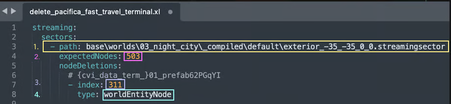

# Removing objects by hand

## Summary

**Created:** July 08 2025 by [mana vortex](https://app.gitbook.com/u/NfZBoxGegfUqB33J9HXuCs6PVaC3 "mention")\
**Last documented update:** July 08 2025 by [mana vortex](https://app.gitbook.com/u/NfZBoxGegfUqB33J9HXuCs6PVaC3 "mention")

This page tells you how to do node removals by hand.&#x20;


This workflow is **extremely not recommended** and only demonstrates the underlying principle. All these steps are **more than techedd away** by now, and you should follow the[world-editing-deleting-objects.md](world-editing-deleting-objects.md "mention")guide.


## Video Guide

Visual learners, celebrate: Proxima Dust made a video guide for this! Everyone else, proceed to the next section for a full step-by-step guide.



## Create a Wolvenkit project

1. Create a [Wolvenkit Project](https://app.gitbook.com/s/-MP_ozZVx2gRZUPXkd4r/wolvenkit-app/usage/wolvenkit-projects#create-a-new-wolvenkit-mod-project)
2. Create an `.xl` file in your Wolvenkit Project's `resources` folder and name it after your world deletion (e.g. `delete_pacifica_fast_travel_terminal.xl`).
   * You can edit this file in Wolvenkit or in a text editor like [Notepad++](https://notepad-plus-plus.org/downloads/)
3. Paste the following code into your .xl file: (we will adjust it later)

```yaml
streaming:
  sectors:
    - path: your\path\from\red_hot_tools\ex_in_terior_99_99_0_0-streamingsector
      expectedNodes: 999
      nodeDeletions:
        # this is a comment
        - index: 0
          type: worldNodeType
```

## Find something to remove

1. Launch the game
2. Go to the location you want to edit (see [places.md](../../../for-mod-creators-theory/references-lists-and-overviews/reference-world-sectors/places.md "mention")for a detailed guide)
3. Find an object that you want to remove and stand in front of it
4. Open your CET overlay

## Add the file entries

### About yaml editing



### Do the work

1. Open the [World Inspector](../../../for-mod-creators-theory/modding-tools/redhottools/#world-inspector) and switch to the `Inspect` tab. You will now see  something like this:

<figure><figcaption></figcaption></figure>

2.  The information in the screenshot above corresponds to your `.xl` file:

    <figure><figcaption></figcaption></figure>
3. Adjust the file entries. Mind the leading spaces, because they structure the information!
   1. for `path`, put the full path to your world sector as seen in RedHotTools (1., yellow on screenshot - `base\worlds\03_night_city_compiled\default\exterior_-35_-35_0_0.streamingsector`)
   2. for `expectedNodes`, put the number of nodes in this sector (2., pink, 503 in the screenshot)
4. For each node that you want to delete, add an entry under `nodeDeletions`:\
   `- index` (the - is important): the node index (3., violet in the screenshot)\
   `type`: the type of the node (4., turquoise in the screenshot)
5. If you want to add moire sectors, add the following lines at the bottom of the file. Make sure that they have the same indent as line 3 on the screenshot above.

```yaml
    - path: base\worlds\path_to_your.streamingsector
      expectedNodes: 999
      nodeDeletions:
        # deletions have this indent level
```

### Testing

1. Run your XL file through [yamllint](https://www.yamllint.com/) and fix any errors. This will&#x20;
2. Save the .xl file
3. [Install your project](https://app.gitbook.com/s/-MP_ozZVx2gRZUPXkd4r/wolvenkit-app/menu/toolbar#install-and-launch) and launch the game.

If everything worked, your object should now be gone.

