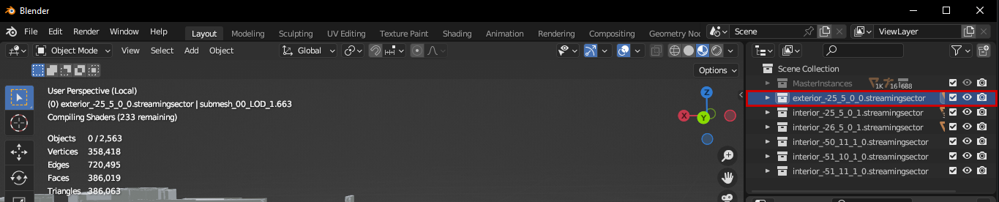
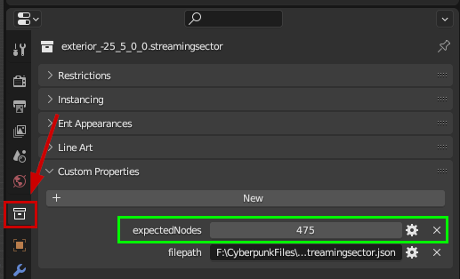
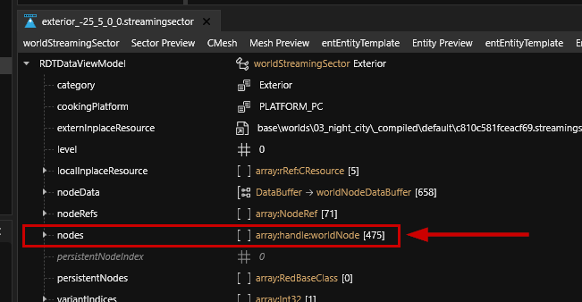
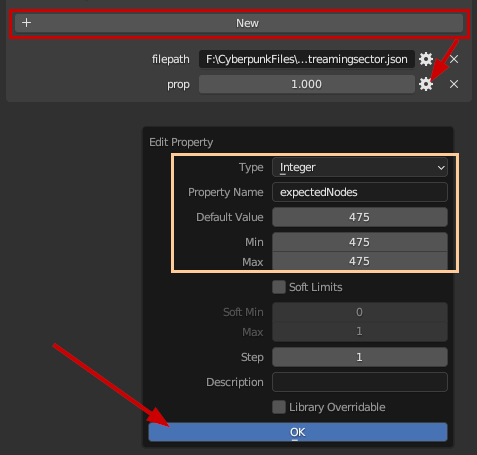
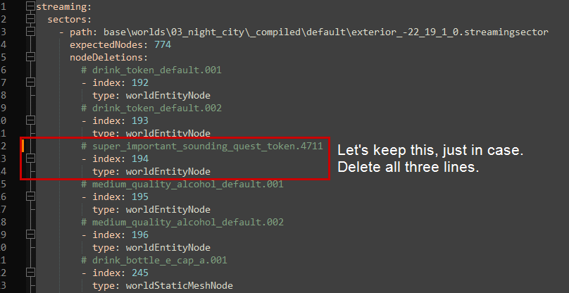

# Manual Removal

## Summary

**Created by @manavortex**\
**Published in October 2023**\
**Last (documented) update: December 2023**

This guide will show you how to remove items from the world via ArchiveXL.

Difficulty: You know how to read. Everything else will hopefully become clear !

#### Requirements

[ArchiveXL ](https://www.nexusmods.com/cyberpunk2077/mods/4198)>= 1.8.0

If you want to do it in Blender: [wolvenkit-blender-io-suite](../../../for-mod-creators-theory/modding-tools/wolvenkit-blender-io-suite/ "mention") >= 1.5.0

Otherwise: [RedHotTools >= 0.5.2](https://github.com/psiberx/cp2077-red-hot-tools/releases)

## RedHotTools and ArchiveXL

This section will walk you through the process of creating an .xl file to remove objects from the game world.


This guide will feature the **manual process**, which can get tedious and is prone to errors.

It is highly recommended to use one of the [Tool Assisted](./#tool-assisted) methods instead


Although you can also work directly in your `archive/pc/mod` directory, you should [create a Wolvenkit project](https://app.gitbook.com/s/-MP_ozZVx2gRZUPXkd4r/wolvenkit-app/usage/wolvenkit-projects), so that you can easily pack your mod for Nexus deployment.

## Video guide

Visual learners, celebrate: OUiJIXOU and Proxima Dust made video guides for this!


by ouijxou



thanks to ProximaDust!


1. Find the node information in the **Inspect** tab of RedHotTools (see [places.md](../../../for-mod-creators-theory/references-lists-and-overviews/reference-world-sectors/places.md "mention")for a detailed guide)
2. Create an `.xl` file in your Wolvenkit Project's `resources` folder and name it after your world deletion (e.g. `delete_pacifica_fast_travel_terminal.xl`).
   * You can edit this file in Wolvenkit or in a text editor like [Notepad++](https://notepad-plus-plus.org/downloads/)

We'll fill in the information in Step 3, this is how it will look:

<figure><figcaption><p>We'll fill in the information in Step 3, this is how it will look.<br>The bottom half of the screenshot is a text editor, you will NOT see this in Cyberpunk!</p></figcaption></figure>

3. Paste the following code into your .xl file:

```yaml
streaming:
  sectors:
    - path: your\path\from\red_hot_tools\ex_in_terior_99_99_0_0-streamingsector
      expectedNodes: 999
      nodeDeletions:
        # this is a comment
        - index: 0
          type: worldNodeType
```

4. Adjust the .xl file. **Mind the leading spaces!**
   1. for `path`, put the full path to your world sector as seen in RedHotTools (1., yellow on screenshot - `base\worlds\03_night_city_compiled\default\exterior_-35_-35_0_0.streamingsector`)
   2. for `expectedNodes`, put the number of nodes in this sector (2., pink, 503 in the screenshot)
   3. For each node that you want to delete, add an entry under `nodeDeletions`:\
      `- index` (the - is important): the node index (3., violet in the screenshot)\
      `type`: the type of the node (4., turquoise in the screenshot)

### Testing

1. Optional, but recommended: Run your XL file through [yamllint](https://www.yamllint.com/)
2. Save the .xl file
3. [Install your project](https://app.gitbook.com/s/-MP_ozZVx2gRZUPXkd4r/wolvenkit-app/menu/toolbar#install-and-launch) and launch the game.

If everything worked, your object should now be gone.

Otherwise, check the [#troubleshooting](world-editing-deleting-objects.md#troubleshooting "mention") section.

### Packing your mod for Nexus

If you have been a good bean and stuck to the instructions, you only need to [pack your Wolvenkit project](https://app.gitbook.com/s/-MP_ozZVx2gRZUPXkd4r/wolvenkit-app/menu/toolbar#pack-mod) and can skip the rest of this section.

If you have been working directly in your `archive/pc/mod` directory, do **not** right-click on your .xl file and pack it. You have to create the following folder structure and then pack the `archive` folder:

```
- archive
  - pc
    - mod
      - your_mod_name.xl
```

If you don't do that, you will drown in comments from confused users who don't know how to install your mod.

## Blender and ArchiveXL

### Prerequisites: Deleting the objects

1. Hit up [editing-locations-in-blender.md](../miscellaneous/editing-locations-in-blender.md "mention") and follow the instructions to import your sectors into Blender.
2. **Optiona, but recommended**: Save the blend file. There's no real way to undo stuff right now other than deleting them from the list by hand, and re-importing is tedious. If you save the file, you can use File -> Revert to undo all your changes.
3. **Select** and **delete** the objects that you want to get rid of.

Now it's time to get exporting.

### Adjust the sector collections' properties


This step will be made obsolete in a future update of the [wolvenkit-blender-io-suite](../../../for-mod-creators-theory/modding-tools/wolvenkit-blender-io-suite/ "mention") (currently 1.5.0). The guide will tell you at which point you can skip ahead if that's the case.


<details>

<summary>Why do we need this?</summary>

ArchiveXL deletes nodes from the sector files **by numeric index** - it doesn't know if `node #123` is a rotten banana peel or Adam Smasher. Checking the number of nodes is a security feature; if your mod is trying to alter a sector with a different number of items than the one you are expecting, it will **break**.

</details>

1. In the Scene Collection (usually at the top right of your Blender viewport), select a sector collection.

<figure><figcaption></figcaption></figure>

2.  Below the viewport in the right side panel, switch to the `Collections` tab and expand the `Custom Properties` header. You need a property with the name of `expectedNodes` (green box).\
    If you have one, you can proceed to [#generating-an-.xl-file](world-editing-deleting-objects.md#generating-an-.xl-file "mention").\
    If you don't have one, keep reading.

    <figure><figcaption></figcaption></figure>

First, you need to find out the number of nodes in your sector. We will do that in Wolvenkit.

3. Find the correct sector file and open it in Wolvenkit. (You can copy the name from the `filepath` field in Custom Properties — the file should be in your project from your earlier export.)
4.  In the CR2W editor, find the `nodes` property and look at the count. That number needs to go into your new property in Blender.

    <figure><figcaption></figcaption></figure>
5. Click `New` to add a new property. It will be called prop and have a value of `1.000`.
6. Click the gear and add the property's properties:\
   \
   `Type` should be `Integer`\
   `Property Name` shoudld be `expectedNodes`\
   `Default Value`, `Min`, and `Max` should be the number of nodes from your sector file.\
   \
   After you have made those changes, click **OK**.\\

<figure><figcaption></figcaption></figure>

7. The value of your new property will probably still be 1 until you click in the field - then it will be updated with the only value possible.
8. Repeat this step for **every sector file**.

### Generating an .xl file

1. Switch to Blender's `Scripting` perspective and create a new file.
2. Open [**this link**](https://raw.githubusercontent.com/manavortex/cyberpunk2077/master/python/export_sector_deletions_to_xl.py) (mana's github) and copy the contents into Blender's editor.
3. Edit the value of `output_filename` — it has to be a valid path (and can even be your Cyberpunk mod directory).


Running the script **will overwrite existing files**. That's not a problem, but you need to take care of backups yourself.


<figure><figcaption></figcaption></figure>

5. When you're done, click the ▶ button in the toolbar to run the script.

You now have an .xl file. If you put it into `archive/pc/mod`, the game should load it. Otherwise, check the [#troubleshooting](world-editing-deleting-objects.md#troubleshooting "mention") section of this guide.

### Removing potential false positives

This step is optional, but recommended, as the script might add nodes to the deletion list that you want to keep.


This is also how you can edit other people's sector presets. Want to keep your candles? Search for "candle" and remove them from the deletion list!


1. Open the generated .xl file in a text editor such as [**Notepad++**](https://notepad-plus-plus.org/downloads/).
2. Search for `worldEntityNode`\
   \&#xNAN;_Keyboard shortcuts to find all in document in Notepad++: `Ctrl+F` - `Alt+D`_
3. Check the comment on top of a block to find out what it is.
4. If you want to keep something, remove the entire block from the .xl file (see screenshot).

<figure><figcaption></figcaption></figure>

5. Put the .xl file into `archive/pc/mod` and start the game. (Don't put your Wolvenkit project, you don't need all that sector garbage!)

That's it! You changed the world - literally! Happy modding, choomba!

### Packing a Wolvenkit project


Do not pack the Wolvenkit project you used for Blender import - you don't need an .archive file


To add the .xl file to a Wolvenkit project, simply put it into the `source/resources` folder and pack. Your mod will include only text files and be really tiny - ArchiveXL does all the heavy lifting.

If your zip for Nexus contains an .archive file, you've done something wrong here!

## Converting older node removals

You can convert node removal scripts from ArchiveXL 1.8 format to 1.9 format by running [this Python script](https://github.com/manavortex/cyberpunk2077/blob/master/python/world_sector_stuff/convert_sector_edits_to_AXL_1.9.py) on the file.

You need:

* a Wolvenkit project with the sectors exported to .json
* an .xl file

Change the following lines in the script:

```python
# the wolvenkit project with your sector json files
wolvenkit_project="F:\\CyberpunkFiles\\world_editing\\apartment_glen_cleaned_up"

# the file that you want to convert
original_file="C:\\Games\\Cyberpunk 2077\\archive\\pc\\mod\\apartment_glen_cleaned_up.archive.xl"

# the file that you want to write to
output_file="C:\\Games\\Cyberpunk 2077\\archive\\pc\\mod\\apartment_glen_cleaned_up.converted.archive.xl"
```

While you can write directly to your output file, you really should not.


After running the conversion script, search your new .xl file for `INVALID_NODE` to filter out any entries that could not be resolved.


## Troubleshooting

### My edits aren't showing up!

Check the ArchiveXL log (you can find it in `Cyberpunk 2077\red4ext\plugins\ArchiveXL\ArchiveXL.log`). For every block in your .xl file, you should see an entry like this:

```
[info] |Streaming| Patching "base\worlds\03_night_city\_compiled\default\quest_2467054678ccf8f6.streamingsector"...
```

#### If you don't see those entries:

* Make sure that your file
  * has the extension `.xl`
  * is located in `archive/pc/mod` or loaded as part of a REDmod (why are you doing this to yourself? You're testing. Put it in `archive/pc/mod`!)
* Check if the syntax is valid by running it through [**yamllint**](https://www.yamllint.com/)
* Make sure that ArchiveXL is up-to-date and working

#### If you see "failed to patch" entries instead:

Check the `expectedNodes` entry inside your `.xl` file against the sector files inside Wolvenkit as per [#adjust-the-sector-collections-properties](world-editing-deleting-objects.md#adjust-the-sector-collections-properties "mention").
