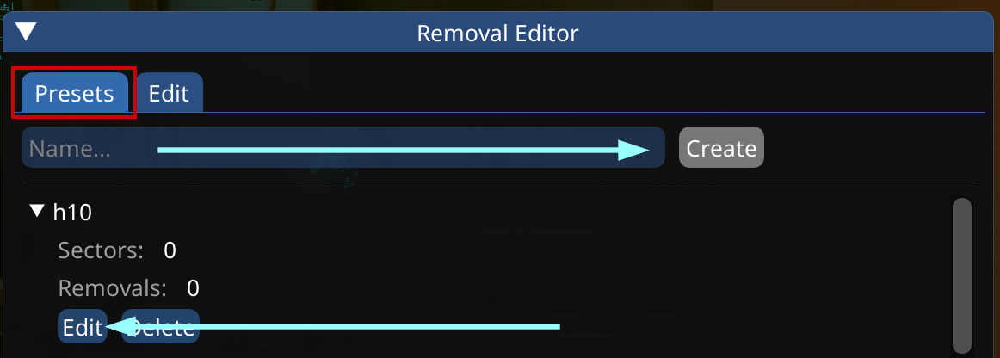
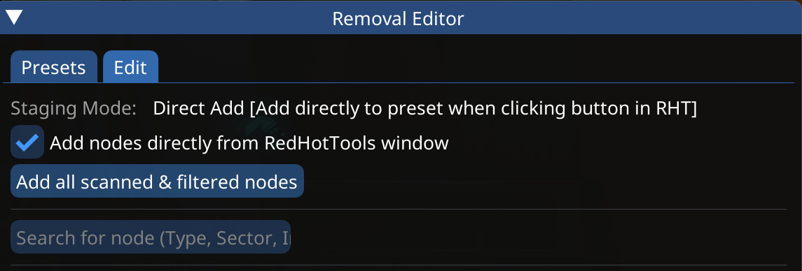
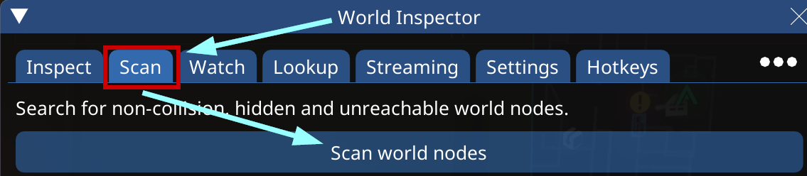
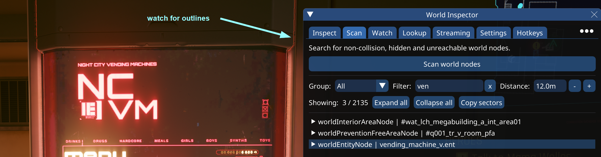
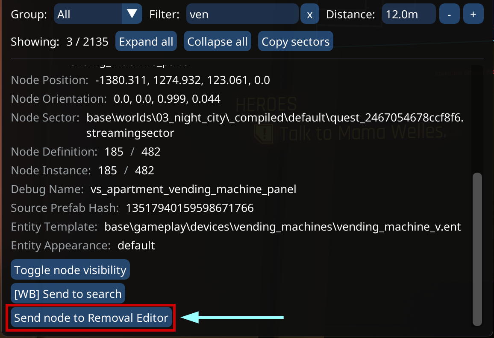
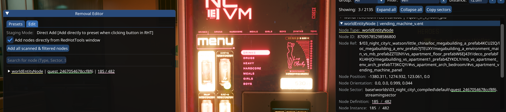
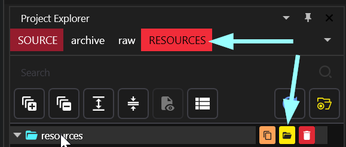

# Removing world objects with Removal Editor

## Summary

**Published:** October 2023 by [mana vortex](https://app.gitbook.com/u/NfZBoxGegfUqB33J9HXuCs6PVaC3 "mention")\
**Last documented update:** July 2025 by [mana vortex](https://app.gitbook.com/u/NfZBoxGegfUqB33J9HXuCs6PVaC3 "mention")

This guide will show you how to remove items from the world via Removal Editor.

**Difficulty:** You know how to read. Everything else will hopefully become clear!

**Estimated completion time:** The tooling has become very good - you should be able to remove an object in <10 minutes.

Wait, this is not what I want!

* To do things the hard way, check [world-object-removal-with-blender.md](world-object-removal-with-blender.md "mention")

## Requirements

* The latest [ArchiveXL ](https://www.nexusmods.com/cyberpunk2077/mods/4198)(at least 1.8.0)
* Removal Editor (optional download on the [World Builder](https://www.nexusmods.com/cyberpunk2077/mods/20660?tab=files) page)
* The latest [RedHotTools](https://github.com/psiberx/cp2077-red-hot-tools/releases/) (see [install instructions](../../../for-mod-creators-theory/modding-tools/redhottools/#installation-guide))

## RemovalEditor, RedHotTools and ArchiveXL


You can either watch the [#video-guide](world-editing-deleting-objects.md#video-guide "mention"), or follow the [#step-by-step](world-editing-deleting-objects.md#step-by-step "mention") instructions.

If you get stuck, refer to the [user-guide-troubleshooting](../../../for-mod-users/user-guide-troubleshooting/ "mention") section at the end of the guide!


## Video guide

Visual learners, celebrate: Proxima Dust made a video guide for this! Everyone else, proceed to the next section for a full step-by-step guide.


thanks to ProximaDust!


## Step-by-step

### 1. Preparation

In this section, you find the object that you want to remove in the game, and create a preset in Removal Editor.

1. Launch the game
2. Go to the location you want to edit (see [places.md](../../../for-mod-creators-theory/references-lists-and-overviews/reference-world-sectors/places.md "mention")for a detailed guide)
3. Find an object that you want to remove and stand in front of it
4. Open your CET overlay
5. Open the Removal Editor UI and create a new preset:

<figure><figcaption></figcaption></figure>

6. Click the "Edit" button. This will switch Removal Editor to the Staging view:

<figure><figcaption></figcaption></figure>

### 2. Removal

Now that the preset is active, we can use RedHotTools to easily remove them.

1. Open the [World Inspector](../../../for-mod-creators-theory/modding-tools/redhottools/#world-inspector) and switch to the `Scan`tab
2. Hit the big "Scan world nodes" button

<figure><figcaption></figcaption></figure>

3. Optional: You can filter your results (see [rht-the-world-inspector.md](../../../for-mod-creators-theory/modding-tools/redhottools/rht-the-world-inspector.md "mention") for more information)
4. Move your mouse over the entries until the object in front of you is highlighted:

<figure><figcaption></figcaption></figure>

3. Expand the node and scroll to the bottom
4. Click the `Send node to Removal Editor`  button

<figure><figcaption></figcaption></figure>

5. The removal editor will now change and list your node:

<figure><figcaption></figcaption></figure>

6. Optional: Repeat this process with as many things as you want.

### 3. Testing

Now that you're done removing objects, let's test.&#x20;

While you were busy clicking buttons, RemovalEditor has done the hard work in the backtground, and generated an `.xl` file for you. This file can be read by ArchiveXL, which will apply your removals.

1. Close the game
2. Open your [the-cyberpunk-2077-game-directory](../../../for-mod-users/users-modding-cyberpunk-2077/the-cyberpunk-2077-game-directory/ "mention") in Windows Explorer
3. Find the `.xl` file under\
   `Cyberpunk 2077\bin\x64\plugins\cyber_engine_tweaks\mods\removalEditor\data` .\
   It will have the same name as the preset that you created in step 1.5.
4. Copy the file to your mod directory: `Cyberpunk 2077\archive\pc\mod`&#x20;
5. Start the game. Your object(s) should now be gone.

## Creating a mod

To share your changes with others, you will want to put it on Nexus. For that, you have to pack the file correctly — and the easiest way to do that is via Wolvenkit.


If you make changes in Removal Editor, you only need to repeat the steps 3 and 4 below, and your mod will be up-to-date for Nexus release!


1. Create a new [Wolvenkit project](https://app.gitbook.com/s/-MP_ozZVx2gRZUPXkd4r/wolvenkit-app/usage/wolvenkit-projects#create-a-new-wolvenkit-mod-project)
2. In the Project Explorer, switch to the Resources tab

<figure><figcaption></figcaption></figure>

1. Select the resources folder in the tree
2. Click the yellow folder icon to open the Windows Explorer here
3. Copy the .xl file from Removal Editor directly into this folder (Step 3.1). Since it is an `.xl` file, Wolvenkit will automatically create the folder structure on packing.
4. In the toolbar, click on [Create Zip](https://app.gitbook.com/s/-MP_ozZVx2gRZUPXkd4r/wolvenkit-app/menu/toolbar#create-zip)
5. Shift-click on the yellow folder icon above the file tree to open the project directory
6. You will see a `project_name.zip`. It should have the following directories:

```
- archive
  - pc
    - mod
      - your_mod_name.xl
```

7. ... and that's it! You can upload the zip file to Nexus!

## Troubleshooting

### I can't open CET!

See [user-guide-troubleshooting](../../../for-mod-users/user-guide-troubleshooting/ "mention")-> [#cet-isnt-starting](../../../for-mod-users/user-guide-troubleshooting/#cet-isnt-starting "mention")

### CET doesn't have a RemovalEditor window!

That means RemovalEditor is not installed correctly. Make sure to install all of its requirements, and their requirements as well. For more information, check [requirements-explained.md](../../../for-mod-users/user-guide-troubleshooting/requirements-explained.md "mention").

### CET doesn't have a World Inspector window!

That means RedHotTools is not installed correctly, or you forgot to install the CET overlay. Double-check [redhottools](../../../for-mod-creators-theory/modding-tools/redhottools/ "mention") ->[#installation-guide](../../../for-mod-creators-theory/modding-tools/redhottools/#installation-guide "mention").

### My edits aren't showing up!

Either ArchiveXL is not installed correctly, or you put your file into the wrong place.\
Check the ArchiveXL log in the following folder by opening it with a text editor:&#x20;

```
Cyberpunk 2077\red4ext\plugins\ArchiveXL\ArchiveXL.log
```

If the file doesn't exist, then ArchiveXL is not installed correctly. Make sure that both your game and the mod are on the most recent version, and install all of the mod's rquirements.

If the file exists, but you can't find your mod in there (Ctrl+F to search), you put your file into the wrong place. Repeat the instructions in [#id-3.-testing](world-editing-deleting-objects.md#id-3.-testing "mention").
