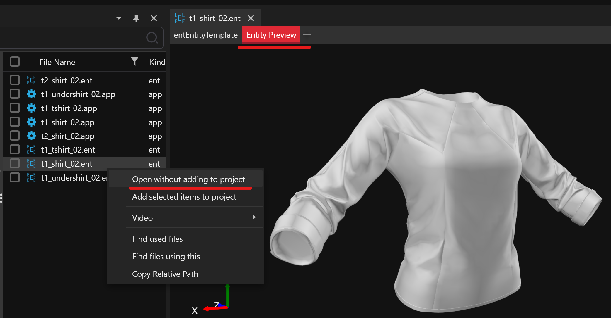

# Setting area outlines

## Usage

* Area nodes are used for a wide variety of things, for example:
  * Soundscapes (E.g. Muffling of outdoor sounds while indoor)
  * Locations (For location notifications)
  * Vehicle Forbidden (Prevents you from driving cars into the area)
  * Prevention (E.g. Removing wanted level)
  * Interior (E.g. For applying gameplay restrictions like no weapons)
  * Death areas
  * Quest Notifiers
  * And more...

## Requirements

### Tools

* [Object Spawner](https://github.com/justarandomguyintheinternet/CP77_entSpawner/releases) (v.0.9. or newer)
* [ArchiveXL](https://github.com/psiberx/cp2077-archive-xl)
* [Codeware ](https://github.com/psiberx/cp2077-codeware/releases)(1.14.1 or newer)
* [WolvenKit](https://github.com/WolvenKit/WolvenKit) (With latest version of Object Spawner import script)

### Knowledge

* You need to have a basic understanding of:
  * Working with WolvenKit
  * Using Object Spawner (Spawning things and [importing](exporting-from-object-spawner.md) into WolvenKit)

## General setup

* In order to have an area node that functions, you need:
  * An area node
  * An outline, defined as a group containing multiple outline markers
* It is generally recommended to create a new group for each outline, which only contains the markers for that specific outline
* Additionally, it is good practice to have one group containing all the outline groups

<figure><figcaption>
Example project layout, one group for all outlines, containing one group per outline
</figcaption></figure>

## Creating outline

* An outline consists of a group containing at least 3 Outline Markers
  * Ideally, the group contains only the markers and nothing else
  * The outline is only useable within the same root group
* Select `Area -> Outline Marker`in Object Spawner, as the spawn category
* Spawn the markers, one by one (Make sure you put them in the correct group, e.g. by selecting the group in the "Spawn New" tab)
* The markers will connect in the order in which they are within the group
* To insert a marker in the middle, simply duplicate the closest marker (`CTRL-D`)

<figure><figcaption>
Example of an outline group with five markers
</figcaption></figure>

## Linking outline to area node

* In order to make an area node use the outline, select the path of the outline group from the `Outline Path`dropdown of the area node
  * Note that only groups containing at least 3 markers, and located within the same root group (In our case the common root group is `Some Mod`) are valid outlines

<figure><figcaption>
Example of linking the outline to an ambient area
</figcaption></figure>


Since the outlines get linked via their path, if you change the name of the outline group, or any parent group (Thus changing its path), the link will break.

Thus it is recommended to keep the outlines in their own group which's name and path will not get changed


## Finishing up

* Now simply export your group from Object Spawner, and import into WKit using the Object Spawner import `.wscript`
