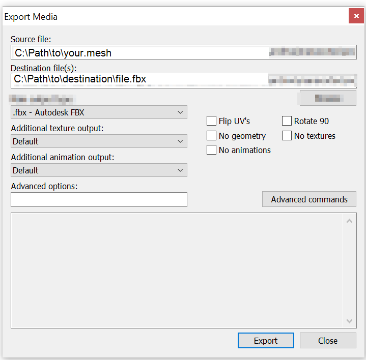
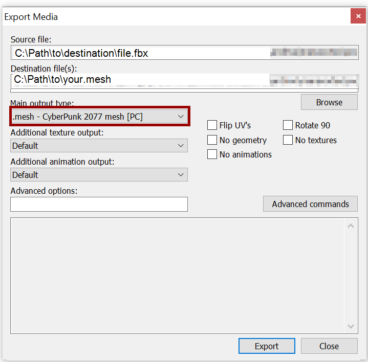
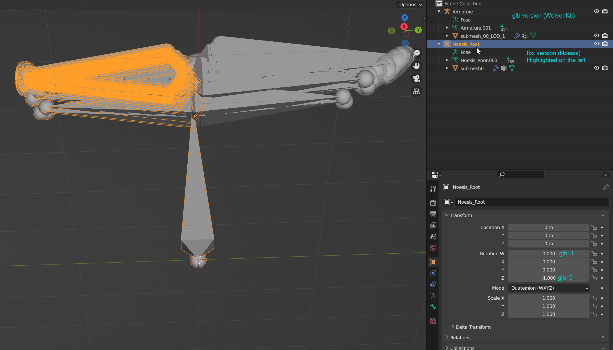

# Exporting and importing meshes


For a guide on exporting a character, see the [WolvenKit wiki](https://wiki.redmodding.org/wolvenkit/guides/modding-community/exporting-to-blender).


## Summary <a href="#summary" id="summary"></a>

**Created by @manavortex**\
**Published November 05 2022**

This guide will show you how to\
\- export meshes from the game for use in other projects\
\- import those meshes back into WolvenKit

Assumed skill level: You are able to read and comprehend instructions.


If you want to replace meshes without editing them, check [this guide](../../modding-guides/items-equipment/editing-existing-items/replace-a-player-item-with-an-npc-item.md).

This guide assumes that you already know which mesh you want to edit. If you do not, check [here](../references-lists-and-overviews/equipment/spawn-codes-baseids-hashes.md#from-a-baseid-to-an-items-materials).


| Tool                                                                                                                                                                                                                       | Tool version                                              |
| -------------------------------------------------------------------------------------------------------------------------------------------------------------------------------------------------------------------------- | --------------------------------------------------------- |
| [WolvenKit](https://github.com/WolvenKit/Wolvenkit/releases)                                                                                                                                                               | >= 8.8.0 _(8.7.0 works, but has a slightly different UI)_ |
| [Blender](https://www.blender.org/download/)                                                                                                                                                                               | >= 3.1 stable                                             |
| <p><a href="https://richwhitehouse.com/index.php?content=inc_projects.php">Noesis</a><br><a href="https://github.com/alphazolam/fmt_CP77mesh?msclkid=384152bfaa5611ecbad0234dbe6a5c45">Noesis Import/Export Plugin</a></p> | <p>>= 4.459<br>>= Sep 28, 2021</p>                        |
| [WKit Blender AddOn](https://github.com/WolvenKit/Cyberpunk-Blender-add-on)[ ](https://github.com/WolvenKit/Cyberpunk-Blender-add-on)                                                                                      | >= 1.1.0                                                  |

You can import and export meshes via WolvenKit **or** Noesis - both methods work.&#x20;


**Before you start editing, a warning:**

It is easy to [break a mesh](exporting-and-importing-meshes.md#troubleshooting-i-cant-import-my-mesh) beyond the point of repair. Make frequent back-ups, and continuously test if your altered mesh still imports and displays in WolvenKit, **especially when editing vertices!**


## Exporting the mesh

### glTF Binary (\*.glb)

WolvenKit <= [8.8](https://github.com/WolvenKit/WolvenKit/releases/tag/8.8.0): Use the Import/Export tool. It is pinned to the sidebar on the right.

WolvenKit > 8.8: Use the Export tool. You can toggle it from the "Tools" menu on the top bar.


Select your mesh in the Export Tool and click "Export/Process Selected".&#x20;

This will create `meshName.glb` in your WKit project's [`raw` directory.](exporting-and-importing-meshes.md#path-example)


Wolvenkit > 8.8 will by default export with materials for the [Cyberpunk Blender Plugin](https://github.com/WolvenKit/Cyberpunk-Blender-add-on).

#### Path example&#x20;

Assuming you are exporting `t2_002_pwa_vest__puffy.mesh`, WolvenKit will do the following:

Path of mesh: `<yourModDir>\source\`**`archive`**`\base\characters\garment\player_equipment\torso\t2_002_vest__puffy\t2_002_pwa_vest__puffy.mesh`

Path of glb: `<yourModDir>\source\`**`raw`**`\base\characters\garment\player_equipment\torso\t2_002_vest__puffy\t2_002_pwa_vest__puffy.glb`


### Autodesk (\*.fbx)


The [Noesis Import/Export Plugin](https://github.com/alphazolam/fmt\_CP77mesh?msclkid=384152bfaa5611ecbad0234dbe6a5c45) is required for this.


Noesis is an **alternative** to exporting with WolvenKit. There are legitimate use cases for why you would want this. If you don't know them, you'll probably not want to use this.

Find your mesh in Noesis. Right-click and select "Export". Then, export with default settings.

<figure><figcaption></figcaption></figure>

## Blender: Saving the mesh

### glTF Binary  (\*.glb)

Make sure to check the box under Data > Mesh > Tangents, as Wolvenkit will not export without it.

<figure><figcaption><p>Export settings: "Tangents" must be checked</p></figcaption></figure>


For WolvenKit > 8.8 and < 8.9, make sure to delete MeshName.Material.json from the raw directory.



**Did you know?**&#x20;

You can change the standard export settings by editing the plugin's `__init__.py`. To find the right path, view the plugin in Blender's `Preferences/Add-ons` menu.&#x20;


This is how you would set Tangents to auto-export in io\_scene\_gltf2 3.4.50:

```python
export_tangents: BoolProperty(
        name='Tangents',
        description='Export vertex tangents with meshes',
        default=True
    )
```

### Autodesk (\*.fbx)

Simply export as fbx, Blender's standard settings are fine for Noesis.

## Importing to \*.mesh


If you are following a guide with pre-made resources and it tells you to import via Noesis, you'll want to follow the advice, as the elements in the exported structure will have different names.

Alternatively, you can run [this script](https://github.com/manavortex/code\_snippets/blob/master/py/blender/convert\_gltf\_fbx.py) on your blend file, which will automatically fix that for you.


### glTF Binary (\*.glb)

You should have **overwritten** your previous glb export. With WKit's Import/Export tool, you can now use the **`Import`** tool to get it back in.


WolvenKit will map any \*.glb file under `raw` to the mesh with the same name under `source`.

Example:

`<yourModDir>\archive\raw\base\characters\garment\player_equipment\torso\t2_002_vest__puffy\t2_002_pwa_vest__puffy.glb`&#x20;

will be imported over

`<yourModDir>\archive\source\base\characters\garment\player_equipment\torso\t2_002_vest__puffy\t2_002_pwa_vest__puffy.mesh`



WolvenKit refuses to import if the target mesh doesn't support all bones in the glb or if your mesh's topology became corrupted. If that's the case, check the [troubleshooting page](self-made-normal-maps/troubleshooting-normal-maps.md).


### Autodesk (\*.fbx)


The [Noesis Import/Export Plugin](https://github.com/alphazolam/fmt\_CP77mesh?msclkid=384152bfaa5611ecbad0234dbe6a5c45) is required for this.


Noesis is an **alternative** to importing with WolvenKit.

Find your fbx in Noesis. Right-click and select "Import".

<figure><figcaption></figcaption></figure>


You need to select a target mesh to import over.


## Differences between fbx and glb

There are a few differences between Noesis and WolvenKit when it comes to exporting your meshes:

<figure><figcaption><p>Note the differently named submeshes</p></figcaption></figure>

|               | Autodesk (fbx) | glTF Binary (glb)   |
| ------------- | -------------- | ------------------- |
| Armature      | Rotation W: 0  | Rotation W: 1       |
|               | Rotation Z: -1 | Rotation Z: 0       |
| Submesh names | submesh0       | submesh\_00\_LOD\_1 |

You can easily convert between the two formats by hand — or use [this script](https://github.com/manavortex/code\_snippets/blob/master/py/blender/convert\_gltf\_fbx.py): Switch to Blender's Scripting perspective, create a new file, paste the contents in, and run it.

## Troubleshooting

If your mesh won't export, try exporting it [without materials](exporting-and-importing-meshes.md#exporting-with-materials).&#x20;

For a list of troubleshooting steps, check the [corresponding wiki page](troubleshooting-your-mesh-edits.md).
