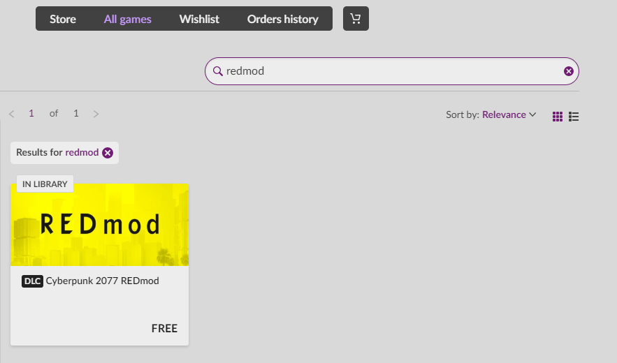
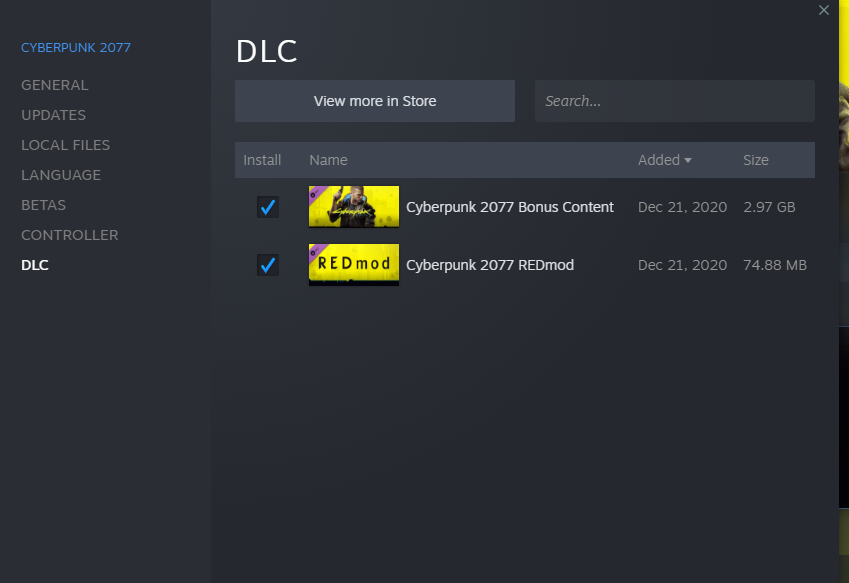

# REDmod

REDmod is a **modding framework** and a set of command line **tools** for modding _Cyberpunk 2077_ that allow you to compile script and tweak source files and allow for sound and animation modding.

## Installation

> To start creating mods or using mods for _Cyberpunk 2077_ you must first install REDmod.

REDmod is shipped as free DLC with the game. You need to add it inside the platform store (GOG, Steam, Epic).

* [DLC Link on GOG](https://www.gog.com/game/cyberpunk\_2077\_redmod)
* [DLC Link on Steam](https://store.steampowered.com/app/2060310/Cyberpunk\_2077\_REDmod/)
* [DLC Link on Epic](https://store.epicgames.com/p/cyberpunk-2077)

### GOG

<figure><figcaption></figcaption></figure>

### Steam

<figure><figcaption></figcaption></figure>

When REDmod is installed correctly you will find a new folder `tools/redmod` inside your game root directory, with subfolders: `bin`, `scripts`, `tweaks`.
