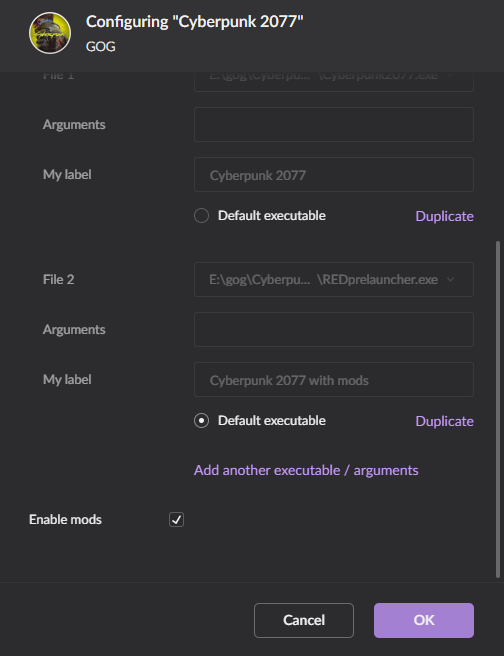
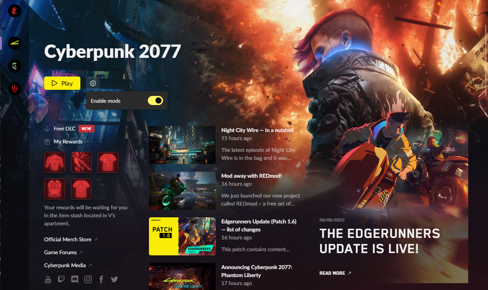

# Usage

REDmod is a tool to stage installed mods to work with a modded game.

There are also various commands for modders to work with the game's assets.

## Using Mods

The game loads mods from this path: `<Cyberpunk 2077>/mods/<name>`.

> EXAMPLE: A simple archive mod `C:\Gog\Cyberpunk 2077\mods\modA\archives\mod_a.archive`.

You need to **deploy** your installed mods before playing a modded game.

You can handle deployment and load order with

* the **REDlauncher** that comes with the game
* **Vortex** Mod Manager from NexusMods
* or use the REDmod WolvenKit integration and manage your mods easily from within the **WolvenKit Mod Manager**.

You need to **start a modded game** in order to load the deployed mods in game.

> Legacy archive mods in `<Cyberpunk 2077>/archive/pc/mod` are still supported but their load order cannot be managed with REDmod.

### Deploying Mods and Starting the Game

REDmod can stage installed mods to work when the game starts with the `modded` flag:

* scripts in `<Cyberpunk 2077>/mods/<name>/scripts` are compiled into a modded script blob
* tweak files in `<Cyberpunk 2077>/mods/<name>/tweaks` are compiled into a modded tweakDB blob
* sound files in `<Cyberpunk 2077>/mods/<name>/customSounds` are staged to load

## Installing

In order to utilize deployed mods with REDmod, you need to run the game in a specific _modded_ mode. You can do this by launching the game through WolvenKit or manually by specifying a command parameter.


Depending on your other mods, you might need to install [cybercmd](https://www.nexusmods.com/cyberpunk2077/mods/5176) as well.


### **GOG Galaxy**

* Open GOG - _Cyberpunk 2077_
* Click **Manage Installation** -> **Configure ...**
* Open the **Features** Tab
* Select **Enable mods**
* Click **OK**
* Play the game
* A window will open showing progress on mod deployment.

<figure><figcaption></figcaption></figure>

### **Steam** and **Epic**

* Navigate to _Cyberpunk 2077_
* Click **Play**
* Click the **Settings** button and **Enable mods**
* Click **Play** (Do not skip this)
* A window will open showing progress on mod deployment.

<figure><figcaption></figcaption></figure>

## Conflicts and Load Order

Conflicts are handled on a per-file basis, but can be handled by specifying a specific _load order_.

**Example:** **modA** contains a script file `C:\Gog\Cyberpunk 2077\mods\modA\scripts\cyberpunk\player\player.script`. **modB** contains a script file with the same name `C:\Gog\Cyberpunk 2077\mods\modB\scripts\cyberpunk\player\player.script`.

This will discard all changes **modB** made, since by default, REDmod and the game loads mods alphabetically (modA overrides changes in modB).

However, you can specify a load order with REDmod, which the game will respect.

## Advanced Topics

### Deploying Mods - Manually

The REDmod `deploy` command stages installed mods to work when the game starts with the `modded` flag.

### Deploying Mods - WolvenKit Integration

* Open the WolvenKit Mod Manager.
* Click the _Deploy Mods_ button in the toolbar.

You will see all installed mods in your game. Enable the mods you would like to play with.

### Handling Conflicts - Manually

You can specify a specific load order with the **-mod** parameter:

```
redmod deploy -root="C:\Gog\Cyberpunk 2077" -mod=modB,modA,modC
```

This will override changes to `\cyberpunk\player\player.script` that **modA** makes in favor of **modB**. It will also tell the game to load **modB** before **modA** and **modC**.

### Handling Conflicts - WolvenKit integration

* Open the WolvenKit Mod Manager.
* Adjust the load order by dragging and dropping rows.
* Click the _Deploy Mods_ button.

You can adjust the load order by dragging and dropping the installed mods inside the mod manager.

When you click the _Deploy Mods_ button, the current load order will be forwarded to redmod.exe and mods will be deployed and loaded in this order.

### Starting a Modded Game - Manually

To start a modded game that loads mods deployed by REDmod use the `-modded` flag on **Cyberpunk2077.exe**

**Example:**

```
Cyberpunk2077.exe -modded
```

This however will skip the initialization process that should be done after any new REDmod mod install.

> INFO The executable is located at `<Cyberpunk 2077>\bin\x64\Cyberpunk2077.exe`
