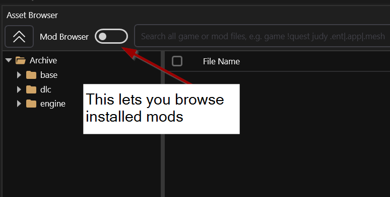
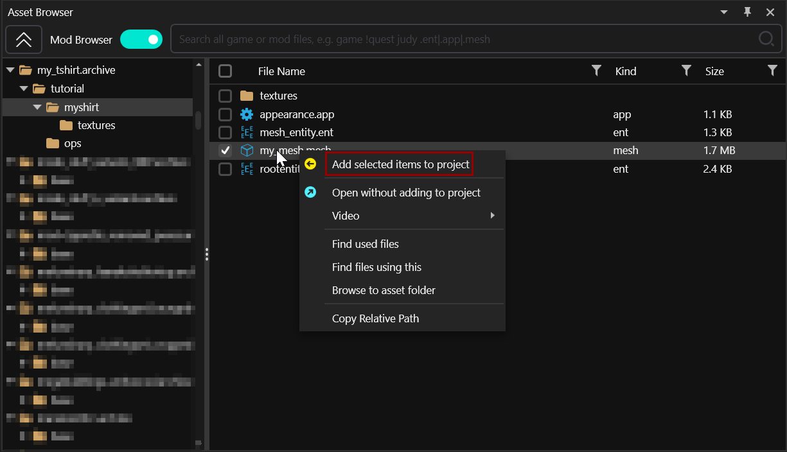

# Analysing other mods

**Created by @manavortex**\
**Published December 11 2022**

This guide will walk you through **extracting archive files** from other modders.&#x20;

### Required: [WolvenKit](https://github.com/WolvenKit/WolvenKit/releases) and/or WolvenKit.cli >= 8.8.0


Please keep in mind that you are looking at somebody else's work. **Always credit** if you use anything from other peoples' mods!




Some modders don't want their mods to be unbundled. Many of those don't mind if you do it for your own personal use, but you should seek permission and respect their decision.


## WolvenKit GUI

<figure><figcaption><p>Switch to "Mod browser"</p></figcaption></figure>

You can now add the content to your project just like you do it with game files:

<figure><figcaption><p>Add items to project</p></figcaption></figure>

## wolvenkit.cli.exe


You need to download the **WolvenKit.Console** version for this, rather than the regular one.&#x20;


1. **Optional, but recommended:** Make sure that your downloaded .archive is inside a folder with no other items.
2. Open WIndows Command _(press Windows+R and type `cmd`, then press enter)._&#x20;
3. Drag and drop WolvenKit.cli.exe into the command window
4. Type a space
5. Type `unbundle -p`
6. Type another space
7. Drag and drop the archive you downloaded into the command window.

You will now see something like

```
"C:/Path/to/Wolvenkit.cli.exe" unbundle -p "D:/Path/to/subdir/downloaded.archive"
```


If your paths contain spaces or special characters, make sure that they are surrounded by quotation marks as in the example above, or the command **will** fail.


If you press enter now, WolvenKit will unpack the archive, putting the contents into the same directory.&#x20;

<pre><code>- Path
  - to
<strong>    - subdir
</strong>        archive.archive
        - base

</code></pre>


You can now copy the extracted folders to your WolvenKit project's `archive` folder.

