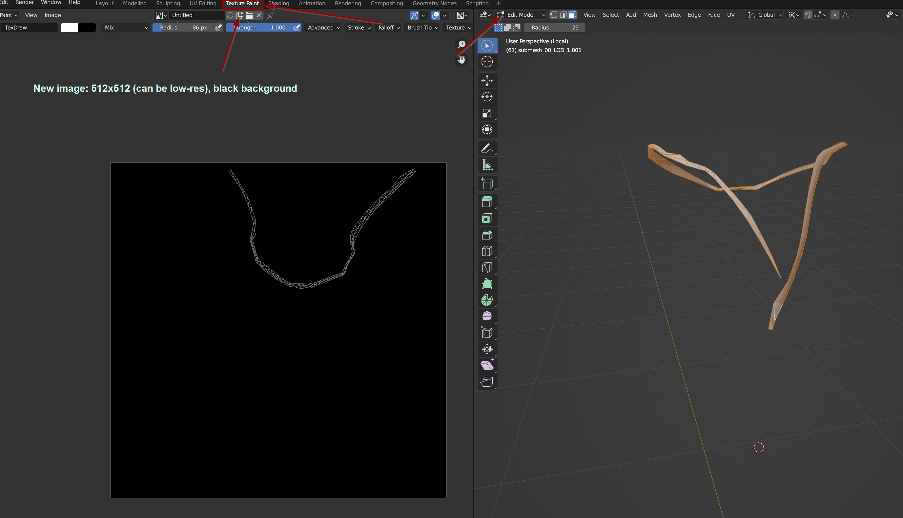
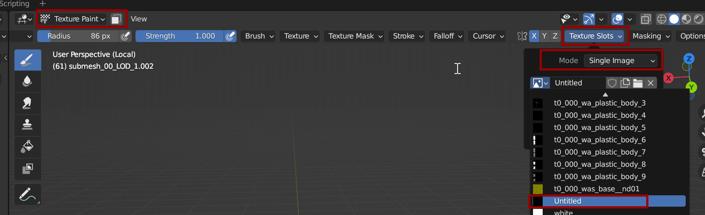
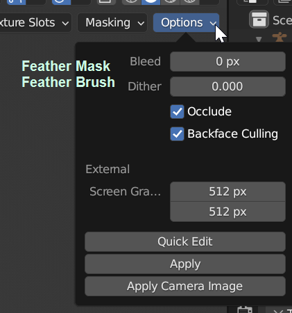
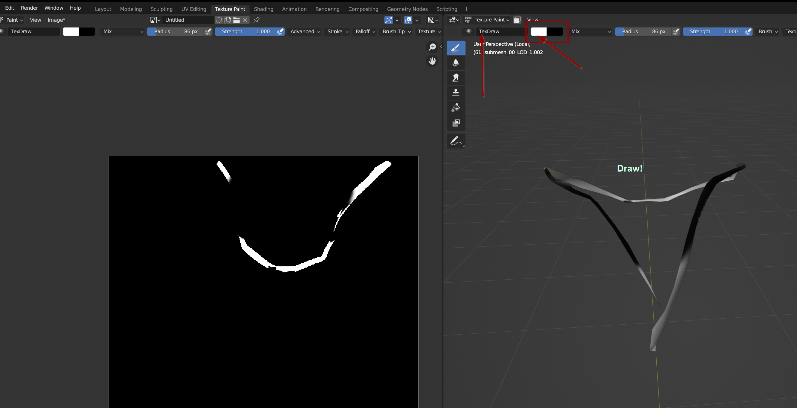

# Custom MultilayerMasks

## Summary <a href="#summary" id="summary"></a>

**Created by @manavortex**\
**Published April 12 2023**

This tutorial will teach you how to create your own MultilayerMask for an item and then assign an own MultilayerSetup to it.&#x20;

Difficulty: You know how to read.


To find out what an MLMask does, see [here](../materials/multilayered.md#what-is-the-mlmask). \
To learn about MLSetups, see [here](../materials/multilayered.md#what-is-the-mlsetup).


## Export the MultilayerMask

Start by adding any .mlmask file to your WKit project. It doesn't matter which one, but you can start with this (6 white layers):

```
base\characters\cyberware\player\a0_005__strongarms\entities\meshes\textures\white.mlmask
```

Then, export it via the Export Tool.&#x20;

This will give you the following file structure:

<pre><code>- name_of_your_mlmask_file.masklist    // file containing a list with relative paths to the images
<strong>- name_of_your_mlmask_file_layers      // folder containing the images 
</strong>  - name_of_your_mlmask_file_0.png
  - name_of_your_mlmask_file_1.png
  - name_of_your_mlmask_file_2.png
  - name_of_your_mlmask_file_3.png
  - name_of_your_mlmask_file_4.png
  - name_of_your_mlmask_file_5.png
</code></pre>

## Blender: Painting the MLMask


1. Add the mesh that's supposed to hold your material to your project and [export it](../3d-modelling/exporting-and-importing-meshes/#exporting-the-mesh).&#x20;
2. Import it into Blender and select the **Texture Paint** perspective.
3. Switch into **Edit Mode**&#x20;
4. Select those parts of the mesh that you want to color.&#x20;
5. Duplicate them (Ctrl +D, ESC) and split off a new submesh (P -> Split Selection).
6. Switch back into Object Mode.&#x20;
7. Select the new submesh; hide the old one.
8.  Create a new image. It can be 512x512 for now; only upscale if you find that you can't get it un-pixelated in-game. Most CDPR layer masks are really low resolution!

    <figure><figcaption></figcaption></figure>
9. Switch the right viewport into "Texture Paint"
10. Find the "Texture Slots" dropdown in the menu (you may have to scroll)
11. Set `Mode` to `Single Image`
12. Select your new black image from the list below.

<figure><figcaption></figcaption></figure>

12. In either of the panels, set your brush foreground color to white (or gray). This determines the transparency of the layer. I recommend that you use white and regulate transparency via mlsetup, but if you want to paint e.g. clothing folds or wear\&tear, you might want to paint greyscale.
13. Optional: Set these properties under "Options":

<figure><figcaption></figcaption></figure>

14. Paint!

<figure><figcaption></figcaption></figure>

15. Rinse and repeat until all parts of your mesh that should have your material are white on the left-hand image.&#x20;
16. Now for the annoying part: On the right side, make sure the mask is more or less smooth, as you will see this in-game.

Now, save the image: overwrite one of the layers from the mlmask that you have exported. If you run out of layers, you can just add them at the end.


The game assumes that layer 1 is white, so start exporting over layers >0


<figure><figcaption></figcaption></figure>

Do this as often as necessary.&#x20;

## Import the MultilayerMask

Once you're done, open the masklisk and make sure that you have exactly as many entries as you have images in your folder (adding or deleting them as needed). Then, in Wolvenkit, import the masklist via **Import Tool**.


All images in the multilayer mask need to have the same resolution. Otherwise, it will crash your game.


You can now assign your new Masklisk to your mesh and use it together with custom [MultilayerSetups](../materials/multilayered.md#what-is-the-mlsetup).&#x20;

<figure><figcaption><p>before => after</p></figcaption></figure>

