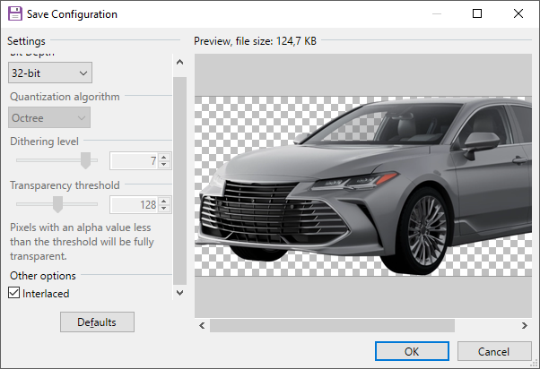
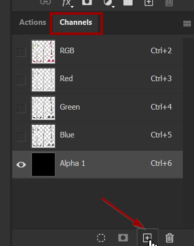
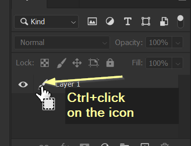

# Images: Importing, editing, exporting


Rache Bartmoss once said: the first step to [importing a texture](images-importing-editing-exporting.md#importing-a-texture) is [exporting a texture](images-importing-editing-exporting.md#exporting-a-texture).



For documentation on the Wolvenkit Import/Export tool, see [here](https://wiki.redmodding.org/wolvenkit/wolvenkit-app/usage/import-export).


## Exporting a texture

1. Add the texture you want to overwrite to your Wolvenkit project.
   1. If necessary, move and rename it. You should stick to the game's naming convention.
2. Find the Export Tool (Tools -> Export Tool) and export the texture.
3. You can now find a png file in your project's `raw` folder.

## Editing a texture

Editing textures is straightforward: just change them in your image editor of choice. The only hitch for reimport is the **transparency**.


Wolvenkit supports the .dds file format, but since that is more complex, we won't talk about it here and stick to the `.png` format. \
_If you're using .dds files, you probably know what you're doing anyway :)_


### Paint.NET

[Paint.NET](https://www.getpaint.net/download.html) is a free image editing software for Windows. It supports PNG transparency out-of-the-box.

<figure><figcaption>
Use 32-Bit to get the highest available image quality.
</figcaption></figure>

### Adobe Photoshop

To export with transparency in Photoshop, you need an **alpha channel**. Fortunately, creating one is simple. (For the initiated: The alpha channel is just a layer mask over the entire image.)

Find the Channels palette at the bottom right of your Workspace and add a new channel:

<figure><figcaption>
You now have an alpha channel.
</figcaption></figure>

Your image will turn black now, because the selected alpha channel will not have transparency yet.


To get your image back, select "RGB" on the Channels palette — but we'll stay on the Alpha channel for now.


In the layers palette, use your image as selection by ctrl+clicking on the layer's icon:

<figure><figcaption>
Layer to selection
</figcaption></figure>

**With the alpha channel selected**, fill your selection with white to mark the transparent parts.&#x20;


The fastest way to do that is to press **d**, **x**, **delete**


You can now save your image as a PNG with transparency. If you have exported a texture in the first section, you should overwrite that file.

## Importing a texture

* Find the Import Tool (Tools -> Import Tool) and select your texture.
* If you have stuck to the game's naming convention, Wolvenkit will select the right preset for you. Otherwise, you need to select the right preset:&#x20;
  * `TexG_Generic_Color` for a diffuse/albedo
  * `TexG_Generic_Normal` for a normal map
  * `TexG_Generic_UI` for anything that you want to use in .inkatlas files
  * … etc
* If your texture is upside-down, uncheck the box for `VFlip`.&#x20;
* Click the "import" button. Your `.png` will now be imported Into the `.xbm` file.
