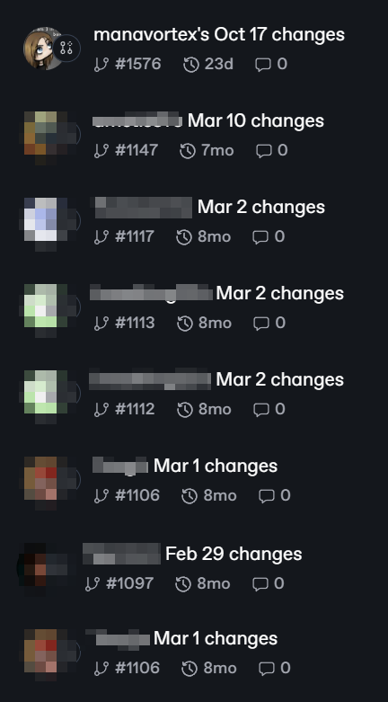
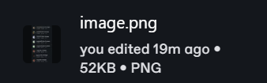
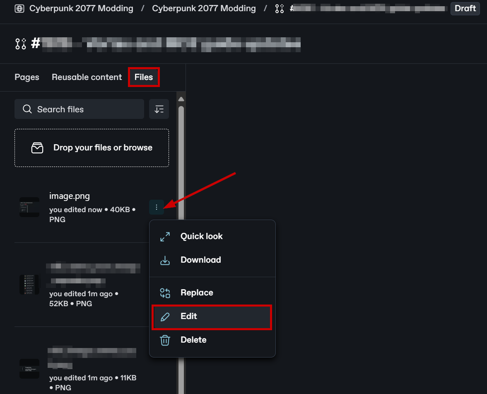
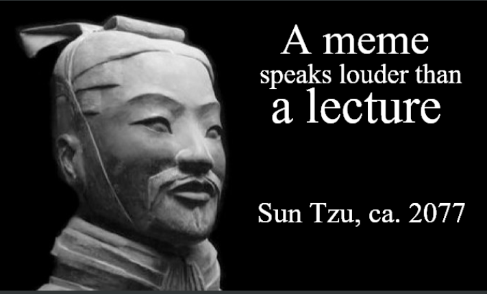

# Editing guidelines

## Summary

**Created:** Nov 10 2024 by [manavortex](https://app.gitbook.com/u/NfZBoxGegfUqB33J9HXuCs6PVaC3 "mention")\
**Last documented update:** Nov 10 2024 by [manavortex](https://app.gitbook.com/u/NfZBoxGegfUqB33J9HXuCs6PVaC3 "mention")

This page contains our wiki editing guidelines.

### Wait, this is not what I want!

* If you would rather learn how to edit the wiki, please check [..](../ "mention") -> [#how-to-edit](../#how-to-edit "mention")

## Basics

### 1. Name your merge requests

The first thing you should do after clicking the "Edit in Change Request" button is to give your merge request a title. Not only will future you be grateful, nothing is more annoying than returning to something like this:&#x20;

<figure><figcaption></figcaption></figure>

### 2. Add a header on new pages

Please give your wiki page a header (see [#summary](./#summary "mention")). You can find a template to copy and paste under [page-header-summary.md](page-header-summary.md "mention").


When updating a page, please adjust the "last documented update" line. (I keep forgetting myself, but it'll help people to see what is up-to-date and what isn't)


### 3. Name your images

You can add images into the editor by either **pasting from clipboard** or **drag-and-dropping a file**.

Unfortunately, gitbook's default name is as helpful as the NCPD customer feedback box:&#x20;

<figure><figcaption>
They <a href="https://github.com/orgs/GitbookIO/discussions/691">know about this</a>, but haven't changed it yet.
</figcaption></figure>

Please **name your images**. As of November 2024, you can find the "`Files`" section on the left, in a tab behind the "`Pages`" tree:

<figure><figcaption></figcaption></figure>

## Styleguide


The internet is full of guides on writing nonfiction. [This one](https://slatestarcodex.com/2016/02/20/writing-advice/) is good.


### Content (what it is)

#### KISS: Keep it simple, stupid

Keep guides **short** and **concise**.&#x20;


Remember that most of the world are not native speakers of English. Keep your sentences short and use **clear language**.

You can use ChatGPT or [goblin.tools **Formalizer**](https://goblin.tools/Formalizer) (`More to the point (unwaffle))` to go over your guides before posting them.


1. It's easier to follow a numbered list than to read a long paragraph
2. Use **bold text** to highlight stuff that is important.
3. For anything extra, check [#put-extra-info-into-expandables](./#put-extra-info-into-expandables "mention").

### Presentation (how it looks)


Your guides should be easy to read. Here's a few tips how to achieve that.


#### Put important stuff in boxes

You probably read the box "Your guides should be easy to read..." first. That's why I put it in a box: I wanted you to!

#### Use headings to split content

You can **link** to headings, which makes them quite useful to split up long guides into manageable content. Here's how I (manavortex) use them:

* **Heading 1** marks the beginning of a section
* **Heading 2** marks the beginning of a subsection within a section
* **Heading 3** splits subsections into individual parts

#### Put extra info into expandables

Anything that's not immediately relevant to the guide (but too interesting to cut out) can go into an **expendable box**.

By the way...

Nobody likes walls of text. By this point most people know that you should have short, sweet paragraphs with line breaks between them. The shorter, the better. If you’re ever debating whether or not to end the paragraph and add a line break, err on the side of “yes”.

Once you understand this principle, you can generalize it to other aspects of your writing. For example, I stole the Last Psychiatrist’s style of section breaks – bold headers saying I., II., III., etc. Now instead of just paragraph breaks, you have two forms of break – paragraph break and section break. On some of my longest posts, including the [Anti-Reactionary FAQ](https://slatestarcodex.com/2013/10/20/the-anti-reactionary-faq/) and [Meditations on Moloch](https://slatestarcodex.com/2014/07/30/meditations-on-moloch/), I add a _third_ level of break – in the first case, a supersection level in large fonts, in the latter, a subsection level with an underlined First, Second, etc. Again, if you’re ever debating more versus fewer breaks, err on the side of “more”.

Finishing a paragraph or section gives people a micro-burst of accomplishment and reward. It helps them chunk the basic insight together and remember it for later. You want people to be going – “okay, insight, good, another insight, good, another insight, good” and then eventually you can tie all of the insights together into a high-level insight. Then you can start over, until eventually at the end you tie all of the high-level insights together. It’s nice and structured and easy to work with. If they’re just following a winding stream of thought wherever it’s going, it’ll take a lot more mental work and they’ll get bored and wander off.

Remember that clickbait comes from big media corporations optimizing for easy readability, and that the epitome of clickbait is the listicle. But the insight of the listicle applies even to much more sophisticated intellectual pieces – people are much happier to read a long thing if they can be tricked into thinking it’s a series of small things.

[Source](https://slatestarcodex.com/2016/02/20/writing-advice/)

#### Use images for clarity

<figure><figcaption></figcaption></figure>

The right image can sum up several paragraphs of writing. Make sure to use the right images.&#x20;

If you include screenshots of anything, make sure to **highlight** the **important parts** (e.g. by drawing boxes and arrows). You can use [Greenshot](https://getgreenshot.org/downloads/) for this.&#x20;
